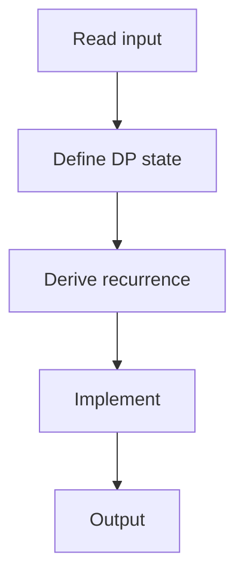

# 69. Removing Digits

## 1. Problem Description

Given `n`, each step subtract a digit of `n` (1-9). Find minimum steps to reach 0.

## 2. Expected Input

`n`.

## 3. Expected Output

Minimum steps.

## 4. Constraints

1 <= n <= 10^6.

## 5. Examples

| Input | Output |
|---|---|
| `27` | `5` |

## 6. Intuition

`dp[i]` = min steps for `i`. `dp[i] = 1 + min(dp[i - d] for d in digits of i)`. Base: `dp[0] = 0`.

## 7. Thought Process



## 8. Brute-Force Approach

Recursion without memo. Exponential.

## 9. Optimized Solution

```python
def solve(n):
    dp = [0] * (n + 1)
    for i in range(1, n + 1):
        digits = [int(d) for d in str(i)]
        dp[i] = 1 + min(dp[i - d] for d in digits if d > 0)
    return dp[n]

if __name__ == "__main__":
    n = int(input())
    print(solve(n))
```

## 10. Why the Optimized Solution Works

At each step, we subtract one of the digits. The optimal is to subtract the digit that leads to the minimum remaining steps.

## 11. Algorithm Used

1D DP.

## 12. Data Structures Used

DP array.

## 13. Time Complexity Analysis

`O(n log n)` (log n digits per number).

## 14. Space Complexity Analysis

`O(n)`.

## 15. Step-by-Step Code Walkthrough

1. `dp[0] = 0`. 2. For each `i`: extract digits, `dp[i] = 1 + min(dp[i - d])`.

## 16. Dry Run with Example

n=27. dp[1]=1, dp[2]=1, ..., dp[27]=5.

## 17. Common Pitfalls

- Including digit 0 (which doesn't subtract). - Not handling single-digit numbers.

## 18. Edge Cases

| n < 10 | 1 |

## 19. Alternative Approaches

Memoized recursion.

## 20. Related Problems

[[65. Dice Combinations]], [[66. Minimizing Coins]]

## 21. Key Takeaways

- Digit-based DP: iterate over digits of the current number. - `str(i)` gives digits easily.
