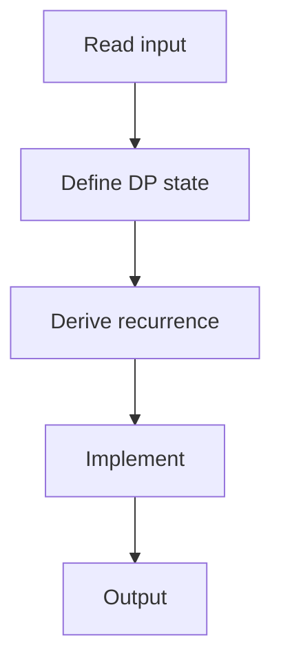

# 70. Grid Paths I

## 1. Problem Description

Count paths from top-left to bottom-right of an n x n grid, moving only right or down, avoiding traps ('.'). Mod 10^9+7.

## 2. Expected Input

First line: `n`. Next `n` lines: grid (.` empty, `*` trap).

## 3. Expected Output

Count mod 10^9+7.

## 4. Constraints

1 <= n <= 1000.

## 5. Examples

| Input | Output |
|---|---|
| `4`<br>`....`<br>`.*..`<br`**..`<br>`....` | `3` |

## 6. Intuition

`dp[r][c]` = number of paths to `(r, c)`. `dp[r][c] = dp[r-1][c] + dp[r][c-1]` if cell is empty, else 0. Base: `dp[0][0] = 1` if empty.

## 7. Thought Process



## 8. Brute-Force Approach

Recursion. Exponential.

## 9. Optimized Solution

```python
def solve(n, grid):
    MOD = 10**9 + 7
    dp = [[0] * n for _ in range(n)]
    if grid[0][0] == '.':
        dp[0][0] = 1
    for r in range(n):
        for c in range(n):
            if grid[r][c] == '*':
                continue
            if r > 0:
                dp[r][c] = (dp[r][c] + dp[r - 1][c]) % MOD
            if c > 0:
                dp[r][c] = (dp[r][c] + dp[r][c - 1]) % MOD
    return dp[n - 1][n - 1]

if __name__ == "__main__":
    n = int(input())
    grid = [input().strip() for _ in range(n)]
    print(solve(n, grid))
```

## 10. Why the Optimized Solution Works

Each cell can be reached from above or from the left. Sum the paths.

## 11. Algorithm Used

2D grid DP.

## 12. Data Structures Used

2D DP array.

## 13. Time Complexity Analysis

`O(n^2)`.

## 14. Space Complexity Analysis

`O(n^2)`.

## 15. Step-by-Step Code Walkthrough

1. `dp[0][0] = 1` if empty. 2. For each cell: if trap, skip; else add from above and left.

## 16. Dry Run with Example

Skipped.

## 17. Common Pitfalls

- Starting on a trap. - Modulo. - Reading grid with newlines.

## 18. Edge Cases

| Start is trap | 0 |

## 19. Alternative Approaches

Space-optimized: 1D DP.

## 20. Related Problems

[[1. Unique Paths]] (NeetCode), [[75. Array Description]]

## 21. Key Takeaways

- **Grid DP**: `dp[r][c] = dp[r-1][c] + dp[r][c-1]`. - Handle traps by setting dp to 0.
