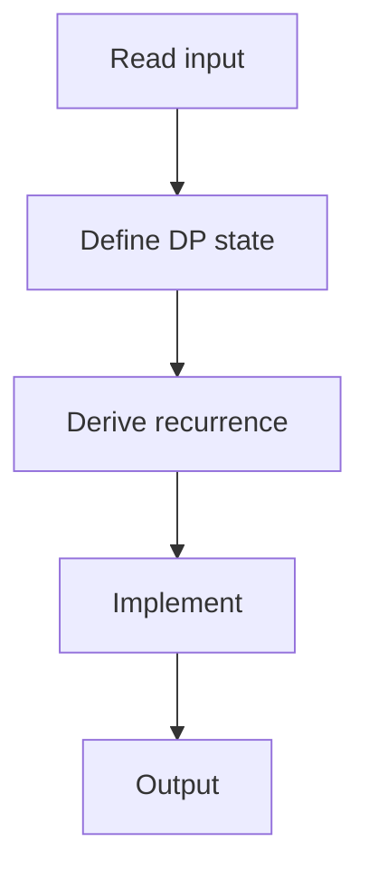

# 71. Edit Distance

## 1. Problem Description

Compute the edit distance (Levenshtein) between two strings: minimum insertions, deletions, substitutions.

## 2. Expected Input

Two strings.

## 3. Expected Output

Edit distance.

## 4. Constraints

1 <= len <= 5000.

## 5. Examples

| Input | Output |
|---|---|
| `LOVE`<br>`MOVIE` | `2` |

## 6. Intuition

`dp[i][j]` = edit distance between `s[:i]` and `t[:j]`. If `s[i-1] == t[j-1]`: `dp[i][j] = dp[i-1][j-1]`. Else: `dp[i][j] = 1 + min(dp[i-1][j], dp[i][j-1], dp[i-1][j-1])` (delete, insert, substitute).

## 7. Thought Process



## 8. Brute-Force Approach

Recursion. Exponential.

## 9. Optimized Solution

```python
def solve(s, t):
    n, m = len(s), len(t)
    dp = [[0] * (m + 1) for _ in range(n + 1)]
    for i in range(n + 1):
        dp[i][0] = i
    for j in range(m + 1):
        dp[0][j] = j
    for i in range(1, n + 1):
        for j in range(1, m + 1):
            if s[i - 1] == t[j - 1]:
                dp[i][j] = dp[i - 1][j - 1]
            else:
                dp[i][j] = 1 + min(dp[i - 1][j], dp[i][j - 1], dp[i - 1][j - 1])
    return dp[n][m]

if __name__ == "__main__":
    s = input().strip()
    t = input().strip()
    print(solve(s, t))
```

## 10. Why the Optimized Solution Works

If characters match, no operation needed. Otherwise, try all three operations and take the minimum.

## 11. Algorithm Used

2D DP (Levenshtein).

## 12. Data Structures Used

2D DP array.

## 13. Time Complexity Analysis

`O(n*m)`.

## 14. Space Complexity Analysis

`O(n*m)`.

## 15. Step-by-Step Code Walkthrough

1. Initialize base cases. 2. For each `(i, j)`: if match, copy diagonal; else 1 + min of three neighbors.

## 16. Dry Run with Example

LOVE vs MOVIE. dp[4][5] = 2.

## 17. Common Pitfalls

- Base cases: `dp[i][0] = i` (delete all), `dp[0][j] = j` (insert all). - Index off-by-one (strings are 0-indexed, dp is 1-indexed).

## 18. Edge Cases

| Empty strings | len of other |

## 19. Alternative Approaches

Space-optimized: 1D DP.

## 20. Related Problems

[[9. Edit Distance]] (NeetCode), [[82. Longest Common Subsequence]]

## 21. Key Takeaways

- **Edit distance DP**: `dp[i][j]` = edit dist between prefixes. - Three operations: insert, delete, substitute. - If match, free; else 1 + min of three.
