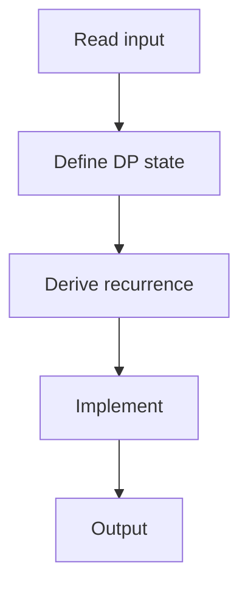

# 73. Rectangle Cutting

## 1. Problem Description

Given an `a x b` rectangle, cut it into squares. Each cut splits one rectangle into two. Find minimum cuts.

## 2. Expected Input

`a, b`.

## 3. Expected Output

Minimum cuts.

## 4. Constraints

1 <= a, b <= 500.

## 5. Examples

| Input | Output |
|---|---|
| `3 5` | `3` |

## 6. Intuition

`dp[a][b]` = min cuts for `a x b`. If `a == b`, 0. Else, try all horizontal and vertical cuts: `dp[a][b] = 1 + min(dp[i][b] + dp[a-i][b] for i in 1..a-1, dp[a][j] + dp[a][b-j] for j in 1..b-1)`.

## 7. Thought Process



## 8. Brute-Force Approach

Recursion.

## 9. Optimized Solution

```python
def solve(a, b):
    dp = [[0] * (b + 1) for _ in range(a + 1)]
    for i in range(1, a + 1):
        for j in range(1, b + 1):
            if i == j:
                dp[i][j] = 0
            else:
                dp[i][j] = float('inf')
                for k in range(1, i):
                    dp[i][j] = min(dp[i][j], 1 + dp[k][j] + dp[i - k][j])
                for k in range(1, j):
                    dp[i][j] = min(dp[i][j], 1 + dp[i][k] + dp[i][j - k])
    return dp[a][b]

if __name__ == "__main__":
    a, b = map(int, input().split())
    print(solve(a, b))
```

## 10. Why the Optimized Solution Works

Each cut splits the rectangle into two smaller ones. Try all possible cuts and take the minimum.

## 11. Algorithm Used

2D DP.

## 12. Data Structures Used

2D DP array.

## 13. Time Complexity Analysis

`O(a*b*(a+b))`.

## 14. Space Complexity Analysis

`O(a*b)`.

## 15. Step-by-Step Code Walkthrough

1. `dp[i][i] = 0` (square). 2. For each `a, b`: try all horizontal and vertical cuts.

## 16. Dry Run with Example

Skipped.

## 17. Common Pitfalls

- Not handling the square case. - Inefficient cutting (try all).

## 18. Edge Cases

| a == b | 0 |

## 19. Alternative Approaches

None.

## 20. Related Problems

[[70. Grid Paths I]], [[74. Money Sums]]

## 21. Key Takeaways

- **Rectangle cutting DP**: try all cuts, take min. - Base case: squares need 0 cuts.
