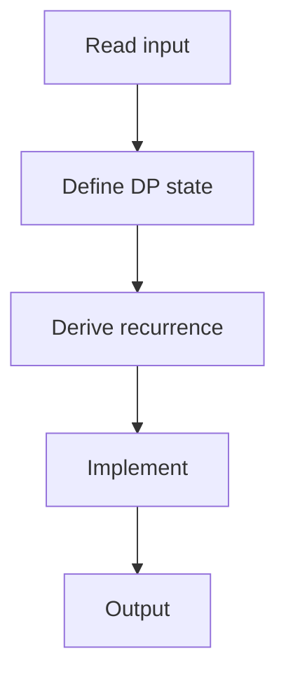

# 74. Money Sums

## 1. Problem Description

Given `n` coins, find all distinct sums that can be formed using subsets.

## 2. Expected Input

First line: `n`. Second line: `n` integers.

## 3. Expected Output

Count of distinct sums, then the sums in sorted order.

## 4. Constraints

1 <= n <= 100, 1 <= x_i <= 1000.

## 5. Examples

| Input | Output |
|---|---|
| `4`<br>`4 2 5 2` | `6`<br>`2 4 5 6 7 9 11 13` |

## 6. Intuition

DP with a set of achievable sums. For each coin, add it to all existing sums.

## 7. Thought Process



## 8. Brute-Force Approach

Generate all subsets. `O(2^n)`.

## 9. Optimized Solution

```python
def solve(coins):
    achievable = {0}
    for c in coins:
        achievable = achievable | {s + c for s in achievable}
    achievable.discard(0)
    return sorted(achievable)

if __name__ == "__main__":
    n = int(input())
    coins = list(map(int, input().split()))
    result = solve(coins)
    print(len(result))
    print(*result)
```

## 10. Why the Optimized Solution Works

Maintaining a set of achievable sums, each coin extends the set by adding itself to every existing sum.

## 11. Algorithm Used

Set-based DP.

## 12. Data Structures Used

Set.

## 13. Time Complexity Analysis

`O(n * sum)`.

## 14. Space Complexity Analysis

`O(sum)`.

## 15. Step-by-Step Code Walkthrough

1. Start with `{0}`. 2. For each coin: union with `{s + coin for s in set}`. 3. Remove 0, sort.

## 16. Dry Run with Example

Skipped.

## 17. Common Pitfalls

- Not removing 0. - Not sorting.

## 18. Edge Cases

| All same | n+1 sums (0, c, 2c, ..., nc) |

## 19. Alternative Approaches

Boolean DP array.

## 20. Related Problems

[[12. Apple Division]], [[60. Two Sets II]]

## 21. Key Takeaways

- **Set-based subset sum**: maintain achievable sums as a set. - Each coin doubles the set (in the worst case).
