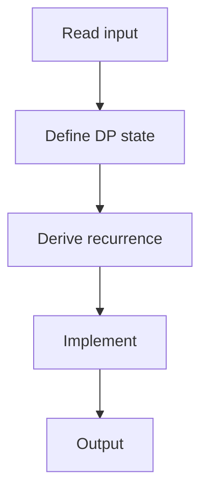

# 75. Array Description

## 1. Problem Description

Build an array of length `n` with values in `[1, m]` where each element differs from its neighbor by at most 1. Some elements are fixed. Count valid arrays. Mod 10^9+7.

## 2. Expected Input

First line: `n, m`. Second line: `n` integers (0 means unspecified).

## 3. Expected Output

Count mod 10^9+7.

## 4. Constraints

1 <= n <= 10^5, 1 <= m <= 100.

## 5. Examples

| Input | Output |
|---|---|
| `3 5`<br>`2 0 2` | `3` |

## 6. Intuition

`dp[i][v]` = number of valid arrays of length `i+1` ending with value `v`. Transition: `dp[i][v] = dp[i-1][v-1] + dp[i-1][v] + dp[i-1][v+1]`. If `arr[i]` is fixed, only consider that value.

## 7. Thought Process



## 8. Brute-Force Approach

Try all arrays. `O(m^n)`.

## 9. Optimized Solution

```python
def solve(n, m, arr):
    MOD = 10**9 + 7
    dp = [[0] * (m + 2) for _ in range(n)]
    # Initialize first position
    if arr[0] == 0:
        for v in range(1, m + 1):
            dp[0][v] = 1
    else:
        dp[0][arr[0]] = 1
    # Fill
    for i in range(1, n):
        if arr[i] == 0:
            for v in range(1, m + 1):
                dp[i][v] = (dp[i - 1][v - 1] + dp[i - 1][v] + dp[i - 1][v + 1]) % MOD
        else:
            v = arr[i]
            dp[i][v] = (dp[i - 1][v - 1] + dp[i - 1][v] + dp[i - 1][v + 1]) % MOD
    return sum(dp[n - 1]) % MOD

if __name__ == "__main__":
    n, m = map(int, input().split())
    arr = list(map(int, input().split()))
    print(solve(n, m, arr))
```

## 10. Why the Optimized Solution Works

Each position's value must be within 1 of the previous. DP tracks the count for each possible ending value.

## 11. Algorithm Used

2D DP.

## 12. Data Structures Used

2D DP array.

## 13. Time Complexity Analysis

`O(n * m)`.

## 14. Space Complexity Analysis

`O(n * m)`, optimizable to `O(m)`.

## 15. Step-by-Step Code Walkthrough

1. Initialize first position. 2. For each subsequent: if fixed, only that value; else all values. 3. Transition from neighbors.

## 16. Dry Run with Example

Skipped.

## 17. Common Pitfalls

- Boundary values (1 and m). - Modulo.

## 18. Edge Cases

| First element fixed | Only that value |

## 19. Alternative Approaches

Space-optimized 1D DP.

## 20. Related Problems

[[70. Grid Paths I]], [[65. Dice Combinations]]

## 21. Key Takeaways

- **Position-value DP**: `dp[i][v]` = count for position `i` ending with value `v`. - Transitions from `(v-1, v, v+1)` capture the 'differs by at most 1' constraint.
