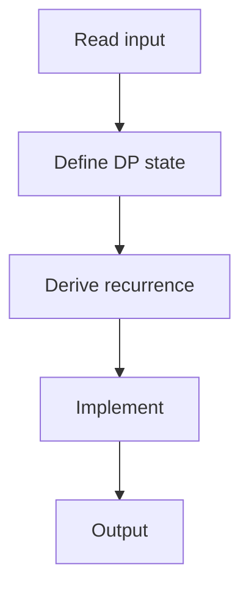

# 77. Counting Tilings

## 1. Problem Description

Count ways to tile an `n x m` grid with 1x2 dominoes. Mod 10^9+7.

## 2. Expected Input

`n, m`.

## 3. Expected Output

Count mod 10^9+7.

## 4. Constraints

1 <= n <= 1000, 1 <= m <= 10.

## 5. Examples

| Input | Output |
|---|---|
| `4 7` | `781` |

## 6. Intuition

Bitmask DP. `dp[i][mask]` = number of ways to tile the first `i` columns such that the `i`-th column has mask (which cells are already filled by horizontal dominoes from column `i-1`).

## 7. Thought Process



## 8. Brute-Force Approach

`O(2^(n*m))`.

## 9. Optimized Solution

```python
def solve(n, m):
    MOD = 10**9 + 7
    # Ensure m is the smaller dimension
    if n < m:
        n, m = m, n
    # dp[mask] = ways to fill columns so far with given mask
    dp = [0] * (1 << m)
    dp[0] = 1
    for col in range(n):
        new_dp = [0] * (1 << m)
        for mask in range(1 << m):
            if dp[mask] == 0:
                continue
            # Try all ways to fill this column
            def fill(row, current_mask, next_mask):
                if row == m:
                    new_dp[next_mask] = (new_dp[next_mask] + dp[mask]) % MOD
                    return
                if current_mask & (1 << row):
                    # Already filled, move on
                    fill(row + 1, current_mask, next_mask)
                else:
                    # Place vertical domino (fills only this cell, no carry to next column)
                    fill(row + 1, current_mask | (1 << row), next_mask)
                    # Place horizontal domino (fills this and next row)
                    if row + 1 < m and not (current_mask & (1 << (row + 1))):
                        fill(row + 2, current_mask | (1 << row) | (1 << (row + 1)), next_mask)
                    # Place horizontal domino across columns (this cell + next column same row)
                    fill(row + 1, current_mask | (1 << row), next_mask | (1 << row))
            fill(0, mask, 0)
        dp = new_dp
    return dp[0]

if __name__ == "__main__":
    n, m = map(int, input().split())
    print(solve(n, m))
```

## 10. Why the Optimized Solution Works

The mask represents which cells in the current column are pre-filled (by horizontal dominoes from the previous column). For each mask, we try all ways to fill the remaining cells: vertical dominoes (within this column), horizontal dominoes (within this column, affecting two rows), or horizontal dominoes across columns (pre-filling the next column).

## 11. Algorithm Used

Bitmask DP.

## 12. Data Structures Used

2D DP array indexed by mask.

## 13. Time Complexity Analysis

`O(n * 3^m)` with optimization.

## 14. Space Complexity Analysis

`O(2^m)`.

## 15. Step-by-Step Code Walkthrough

1. `dp[0] = 1`. 2. For each column: for each mask, try all fillings. 3. Answer is `dp[0]` (all columns filled, no spillover).

## 16. Dry Run with Example

Skipped.

## 17. Common Pitfalls

- Mask representation. - The three placement options. - Ensuring m is the smaller dimension.

## 18. Edge Cases

| Odd total cells | 0 |

## 19. Alternative Approaches

None.

## 20. Related Problems

[[70. Grid Paths I]], [[75. Array Description]]

## 21. Key Takeaways

- **Bitmask DP** for tiling/grid problems with small second dimension. - Mask = which cells in current column are pre-filled. - Try all placements recursively.
