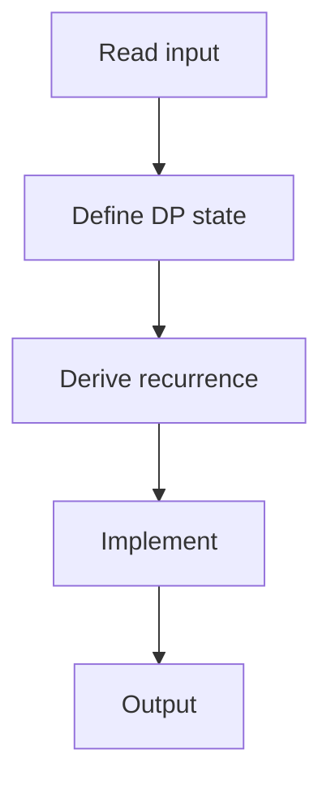

# 82. Longest Common Subsequence

## 1. Problem Description

Find the longest common subsequence of two strings.

## 2. Expected Input

Two strings.

## 3. Expected Output

The LCS string.

## 4. Constraints

1 <= len <= 1000.

## 5. Examples

| Input | Output |
|---|---|
| `ABCBDAB`<br>`BDCAB` | `BCAB` |

## 6. Intuition

`dp[i][j]` = length of LCS of `s[:i]` and `t[:j]`. If `s[i-1] == t[j-1]`: `dp[i][j] = dp[i-1][j-1] + 1`. Else: `dp[i][j] = max(dp[i-1][j], dp[i][j-1])`. Backtrack to find the string.

## 7. Thought Process



## 8. Brute-Force Approach

Try all subsequences. Exponential.

## 9. Optimized Solution

```python
def solve(s, t):
    n, m = len(s), len(t)
    dp = [[0] * (m + 1) for _ in range(n + 1)]
    for i in range(1, n + 1):
        for j in range(1, m + 1):
            if s[i - 1] == t[j - 1]:
                dp[i][j] = dp[i - 1][j - 1] + 1
            else:
                dp[i][j] = max(dp[i - 1][j], dp[i][j - 1])
    # Backtrack
    lcs = []
    i, j = n, m
    while i > 0 and j > 0:
        if s[i - 1] == t[j - 1]:
            lcs.append(s[i - 1])
            i -= 1; j -= 1
        elif dp[i - 1][j] > dp[i][j - 1]:
            i -= 1
        else:
            j -= 1
    return ''.join(reversed(lcs))

if __name__ == "__main__":
    s = input().strip()
    t = input().strip()
    print(solve(s, t))
```

## 10. Why the Optimized Solution Works

If characters match, extend the LCS. Otherwise, take the best of skipping one character from either string.

## 11. Algorithm Used

2D DP + backtracking.

## 12. Data Structures Used

2D DP array.

## 13. Time Complexity Analysis

`O(n*m)`.

## 14. Space Complexity Analysis

`O(n*m)`.

## 15. Step-by-Step Code Walkthrough

1. Fill DP table. 2. Backtrack from `dp[n][m]`: if match, include and move diagonally; else move in the direction of larger value.

## 16. Dry Run with Example

Skipped.

## 17. Common Pitfalls

- Backtracking direction. - Off-by-one in indices.

## 18. Edge Cases

| No common | empty string |

## 19. Alternative Approaches

Hirschberg's algorithm for `O(n)` space.

## 20. Related Problems

[[71. Edit Distance]], [[2. Longest Common Subsequence]] (NeetCode)

## 21. Key Takeaways

- **LCS DP**: if match, `dp[i-1][j-1] + 1`; else `max(dp[i-1][j], dp[i][j-1])`. - Backtrack to recover the string.
