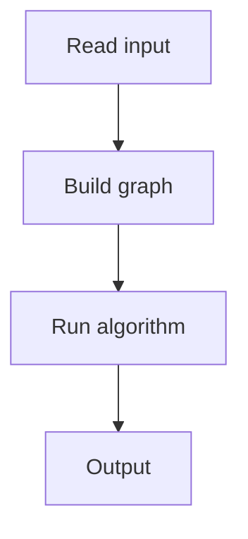

# 101. Course Schedule

## 1. Problem Description

Find an order to take `n` courses given `m` prerequisites (a must come before b).

## 2. Expected Input

`n, m` and edges `a -> b`.

## 3. Expected Output

Topological order, or `IMPOSSIBLE`.

## 4. Constraints

1 <= n <= 10^5.

## 5. Examples

| Input | Output |
|---|---|
| `5 3`<br>`1 2`<br>`2 3`<br>`4 5` | `1 4 2 5 3` |

## 6. Intuition

Topological sort via BFS (Kahn's algorithm). Compute in-degrees, queue nodes with in-degree 0, process and decrement neighbors.

## 7. Thought Process



## 8. Brute-Force Approach

DFS with cycle detection.

## 9. Optimized Solution

```python
from collections import deque

def solve(n, m, edges):
    adj = [[] for _ in range(n + 1)]
    in_deg = [0] * (n + 1)
    for a, b in edges:
        adj[a].append(b)
        in_deg[b] += 1
    q = deque([v for v in range(1, n + 1) if in_deg[v] == 0])
    order = []
    while q:
        u = q.popleft()
        order.append(u)
        for v in adj[u]:
            in_deg[v] -= 1
            if in_deg[v] == 0:
                q.append(v)
    return order if len(order) == n else None

if __name__ == "__main__":
    n, m = map(int, input().split())
    edges = [tuple(map(int, input().split())) for _ in range(m)]
    result = solve(n, m, edges)
    if result:
        print(*result)
    else:
        print('IMPOSSIBLE')
```

## 10. Why the Optimized Solution Works

Kahn's algorithm processes nodes with no remaining prerequisites. If the order doesn't include all nodes, there's a cycle.

## 11. Algorithm Used

Kahn's topological sort.

## 12. Data Structures Used

Adjacency list, in-degree array, queue.

## 13. Time Complexity Analysis

`O(n + m)`.

## 14. Space Complexity Analysis

`O(n + m)`.

## 15. Step-by-Step Code Walkthrough

1. Compute in-degrees. 2. Queue in-degree-0 nodes. 3. Process: decrement neighbors, enqueue if 0.

## 16. Dry Run with Example

Skipped.

## 17. Common Pitfalls

- Not detecting cycles. - Wrong queue initialization.

## 18. Edge Cases

| Cycle | IMPOSSIBLE |

## 19. Alternative Approaches

DFS-based topological sort.

## 20. Related Problems

[[102. Longest Flight Route]], [[8. Course Schedule]] (NeetCode)

## 21. Key Takeaways

- **Kahn's algorithm**: BFS on in-degrees. - If output size < n, there's a cycle. - Topological sort only works on DAGs.
