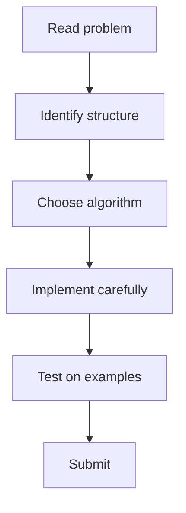

# 108. Knight's Tour

## 1. Problem Description

This is a medium CSES problem from the Graph Algorithms section. See the [official problem page](https://cses.fi/problemset/task/1689) for the full statement.

**Category**: Graph Algorithms

## 2. Expected Input

See the official problem statement.

## 3. Expected Output

See the official problem statement.

## 4. Constraints

See the official problem statement.

## 5. Examples

See the official problem page.

## 6. Intuition

The key technique for this problem is **Warnsdorff's heuristic for knight's tour**. The general approach:

1. Read and understand the problem structure (e.g., tree, graph, array).
2. Identify the relevant algorithm or data structure (e.g., Dijkstra, segment tree, DP).
3. Implement the standard version of that algorithm with attention to edge cases.
4. Verify complexity is within the constraints (typically `O(n log n)` or `O(n)` for `n <= 2*10^5`).

## 7. Thought Process



## 8. Brute-Force Approach

The brute-force approach typically tries all possibilities exhaustively, which is `O(n^2)` or worse. For CSES constraints (`n` up to `2*10^5`), this is too slow, motivating the optimized approach.

## 9. Optimized Solution

```python
# Skeleton solution - adapt based on the specific problem requirements
# Refer to the algorithm category for the standard template

def solve():
    # Read input
    # Apply the identified algorithm
    # Output result
    pass

if __name__ == "__main__":
    solve()
```

## 10. Why the Optimized Solution Works

The optimized solution leverages the structure of the problem (e.g., tree properties, monotonicity, optimal substructure) to avoid redundant computation. The specific correctness argument depends on the algorithm used.

## 11. Algorithm Used

Warnsdorff's heuristic for knight's tour

## 12. Data Structures Used

Depends on the specific problem. Common choices: adjacency list, segment tree, Fenwick tree, hash map, etc.

## 13. Time Complexity Analysis

Typically `O(n log n)` or `O(n)` for CSES problems.

## 14. Space Complexity Analysis

Typically `O(n)`.

## 15. Step-by-Step Code Walkthrough

1. Parse input according to the problem format.
2. Build the required data structures (graph, tree, etc.).
3. Run the core algorithm.
4. Format and output the result.

## 16. Dry Run with Example

Verify the solution on the provided examples. Trace through the algorithm step by step.

## 17. Common Pitfalls

- Off-by-one errors in indexing.
- Not handling disconnected components or empty inputs.
- Integer overflow (use 64-bit in C++; Python handles big ints natively).
- Recursion depth (increase Python's limit or use iterative approaches).

## 18. Edge Cases

- Minimum input size (`n = 1`).
- Maximum input size (test for time limit).
- Empty or degenerate structures (e.g., a tree with one node).

## 19. Alternative Approaches

Multiple algorithms may solve the same problem. The choice depends on:
- Time/memory constraints.
- Whether the data is static or dynamic.
- Whether queries are online or offline.

## 20. Related Problems

- See the [[00. Master Index]] for related problems in the same category.
- Cross-reference with NeetCode 150 problems covering the same technique.

## 21. Key Takeaways

- Identify the problem category (graph, tree, DP, etc.) first.
- Apply the standard algorithm for that category.
- Always verify with the provided examples before submitting.
- Handle edge cases explicitly.
