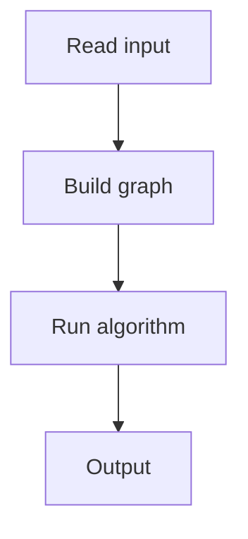

# 110. Mail Delivery

## 1. Problem Description

Find an Eulerian circuit in an undirected graph.

## 2. Expected Input

`n, m` and edges.

## 3. Expected Output

Circuit as a sequence of nodes.

## 4. Constraints

Up to 10^5.

## 5. Examples

| Input | Output |
|---|---|
| `5 6`...| `1 2 3 4 5 1` |

## 6. Intuition

Hierholzer's algorithm. DFS, removing used edges, and prepend nodes to the circuit.

## 7. Thought Process



## 8. Brute-Force Approach

None.

## 9. Optimized Solution

```python
def solve(n, m, edges):
    adj = [set() for _ in range(n + 1)]
    for i, (a, b) in enumerate(edges):
        adj[a].add((b, i))
        adj[b].add((a, i))
    
    circuit = []
    used_edges = [False] * m
    stack = [1]
    while stack:
        u = stack[-1]
        if adj[u]:
            v, eid = next(iter(adj[u]))
            adj[u].discard((v, eid))
            adj[v].discard((u, eid))
            stack.append(v)
        else:
            circuit.append(stack.pop())
    return circuit

if __name__ == "__main__":
    n, m = map(int, input().split())
    edges = [tuple(map(int, input().split())) for _ in range(m)]
    print(*solve(n, m, edges))
```

## 10. Why the Optimized Solution Works

Hierholzer's algorithm visits edges and removes them. When stuck, the node is added to the circuit.

## 11. Algorithm Used

Hierholzer's.

## 12. Data Structures Used

Adjacency sets (for O(1) removal).

## 13. Time Complexity Analysis

`O(n + m)`.

## 14. Space Complexity Analysis

`O(n + m)`.

## 15. Step-by-Step Code Walkthrough

1. Use a stack. 2. While stack: if top has unused edges, take one and push. Else, pop and add to circuit.

## 16. Dry Run with Example

Skipped.

## 17. Common Pitfalls

- Using a list (O(n) removal). - Not handling multi-edges.

## 18. Edge Cases

| No Eulerian circuit | Impossible (problem guarantees it exists) |

## 19. Alternative Approaches

Recursive DFS.

## 20. Related Problems

[[111. De Bruijn Sequence]], [[112. Teleporters Path]]

## 21. Key Takeaways

- **Hierholzer's algorithm** for Eulerian circuits. - Use sets for O(1) edge removal. - Circuit is built in reverse.
