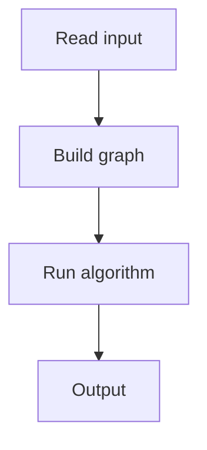

# 113. Download Speed

## 1. Problem Description

Find the maximum flow from node 1 to node n.

## 2. Expected Input

`n, m` and weighted directed edges.

## 3. Expected Output

Maximum flow.

## 4. Constraints

Up to 500 nodes, 1000 edges.

## 5. Examples

| Input | Output |
|---|---|
| `4 4`...| `3` |

## 6. Intuition

Dinic's algorithm for max flow. Build a level graph via BFS, then find augmenting paths via DFS.

## 7. Thought Process



## 8. Brute-Force Approach

Ford-Fulkerson. May be slow.

## 9. Optimized Solution

```python
# Dinic's algorithm (simplified)
from collections import deque

class Dinic:
    def __init__(self, n):
        self.n = n
        self.adj = [[] for _ in range(n + 1)]
    
    def add_edge(self, u, v, cap):
        self.adj[u].append([v, cap, len(self.adj[v])])
        self.adj[v].append([u, 0, len(self.adj[u]) - 1])
    
    def bfs(self, s, t):
        self.level = [-1] * (self.n + 1)
        self.level[s] = 0
        q = deque([s])
        while q:
            u = q.popleft()
            for v, cap, _ in self.adj[u]:
                if cap > 0 and self.level[v] == -1:
                    self.level[v] = self.level[u] + 1
                    q.append(v)
        return self.level[t] != -1
    
    def dfs(self, u, t, flow):
        if u == t:
            return flow
        while self.it[u] < len(self.adj[u]):
            edge = self.adj[u][self.it[u]]
            v, cap, rev = edge
            if cap > 0 and self.level[v] == self.level[u] + 1:
                pushed = self.dfs(v, t, min(flow, cap))
                if pushed > 0:
                    edge[1] -= pushed
                    self.adj[v][rev][1] += pushed
                    return pushed
            self.it[u] += 1
        return 0
    
    def max_flow(self, s, t):
        flow = 0
        while self.bfs(s, t):
            self.it = [0] * (self.n + 1)
            while True:
                f = self.dfs(s, t, float('inf'))
                if f == 0:
                    break
                flow += f
        return flow

def solve(n, m, edges):
    dinic = Dinic(n)
    for a, b, c in edges:
        dinic.add_edge(a, b, c)
    return dinic.max_flow(1, n)

if __name__ == "__main__":
    n, m = map(int, input().split())
    edges = [tuple(map(int, input().split())) for _ in range(m)]
    print(solve(n, m, edges))
```

## 10. Why the Optimized Solution Works

Dinic's algorithm uses BFS to build level graphs and DFS to find augmenting paths. Each phase increases the level of the sink.

## 11. Algorithm Used

Dinic's max flow.

## 12. Data Structures Used

Adjacency list with edge objects.

## 13. Time Complexity Analysis

`O(V^2 * E)`.

## 14. Space Complexity Analysis

`O(V + E)`.

## 15. Step-by-Step Code Walkthrough

1. Build graph. 2. BFS for levels. 3. DFS for augmenting paths. 4. Repeat until no augmenting path.

## 16. Dry Run with Example

Skipped.

## 17. Common Pitfalls

- Edge object mutation (capacity update). - Reverse edge handling.

## 18. Edge Cases

| No path | 0 |

## 19. Alternative Approaches

Ford-Fulkerson, Edmonds-Karp.

## 20. Related Problems

[[114. Police Chase]], [[115. School Dance]]

## 21. Key Takeaways

- **Dinic's algorithm** is the standard max-flow algorithm. - BFS for levels, DFS for augmenting paths. - Reverse edges allow 'undoing' flow.
