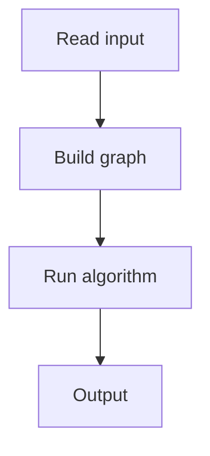

# 84. Counting Rooms

## 1. Problem Description

Given an `n x m` grid, count the number of connected components of `.` cells (rooms). Walls are `#`.

## 2. Expected Input

First line: `n, m`. Next `n` lines: grid.

## 3. Expected Output

Number of rooms.

## 4. Constraints

1 <= n, m <= 1000.

## 5. Examples

| Input | Output |
|---|---|
| `5 8`<br>`########`<br>`#..#...#`<br>`####.#.#`<br>`#..#...#`<br>`########` | `3` |

## 6. Intuition

Flood fill with BFS/DFS. For each unvisited `.` cell, start a BFS and mark all reachable `.` cells as visited. Count the number of BFS starts.

## 7. Thought Process



## 8. Brute-Force Approach

None better.

## 9. Optimized Solution

```python
from collections import deque

def solve(n, m, grid):
    visited = [[False] * m for _ in range(n)]
    rooms = 0
    for r in range(n):
        for c in range(m):
            if grid[r][c] == '.' and not visited[r][c]:
                rooms += 1
                # BFS
                q = deque([(r, c)])
                visited[r][c] = True
                while q:
                    cr, cc = q.popleft()
                    for dr, dc in [(-1,0),(1,0),(0,-1),(0,1)]:
                        nr, nc = cr + dr, cc + dc
                        if 0 <= nr < n and 0 <= nc < m and grid[nr][nc] == '.' and not visited[nr][nc]:
                            visited[nr][nc] = True
                            q.append((nr, nc))
    return rooms

if __name__ == "__main__":
    n, m = map(int, input().split())
    grid = [input().strip() for _ in range(n)]
    print(solve(n, m, grid))
```

## 10. Why the Optimized Solution Works

BFS explores all cells in the same connected component. Starting BFS once per component and counting starts gives the number of components.

## 11. Algorithm Used

BFS flood fill.

## 12. Data Structures Used

2D visited array, queue.

## 13. Time Complexity Analysis

`O(n*m)`.

## 14. Space Complexity Analysis

`O(n*m)`.

## 15. Step-by-Step Code Walkthrough

1. For each cell: if `.` and unvisited, increment count and BFS.

## 16. Dry Run with Example

Skipped.

## 17. Common Pitfalls

- Recursion depth for DFS (use BFS or increase limit). - Visiting walls.

## 18. Edge Cases

| All walls | 0 |

## 19. Alternative Approaches

DFS, Union-Find.

## 20. Related Problems

[[85. Labyrinth]], [[86. Monsters]], [[1. Number of Islands]] (NeetCode)

## 21. Key Takeaways

- **Flood fill** counts connected components. - BFS avoids recursion depth issues.
