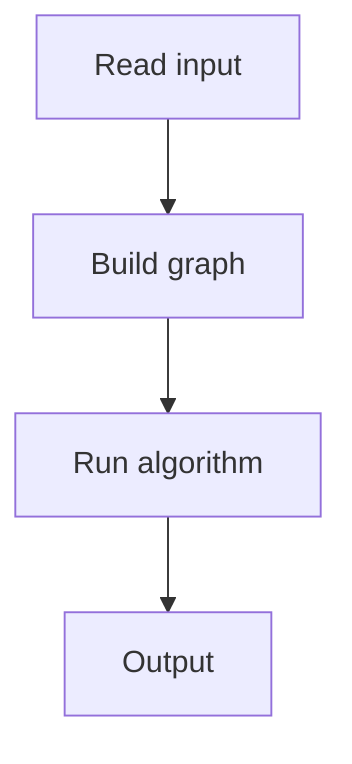

# 85. Labyrinth

## 1. Problem Description

Find a path from `A` to `B` in a grid. Output any shortest path as a sequence of `U, D, L, R`.

## 2. Expected Input

First line: `n, m`. Next `n` lines: grid with `A` and `B`.

## 3. Expected Output

Path length and directions, or `NO`.

## 4. Constraints

1 <= n, m <= 1000.

## 5. Examples

| Input | Output |
|---|---|
| `5 8`<br>`########`<br>`#A#...#.`<br>`#.##.#.#`<br>`#.....#`<br>`########B` | `9`<br>`DDDDRRRRR` |

## 6. Intuition

BFS from `A`. Track the parent and direction for each cell. Backtrack from `B` to `A` to recover the path.

## 7. Thought Process



## 8. Brute-Force Approach

DFS. May not find shortest.

## 9. Optimized Solution

```python
from collections import deque

def solve(n, m, grid):
    # Find A and B
    start = end = None
    for r in range(n):
        for c in range(m):
            if grid[r][c] == 'A': start = (r, c)
            if grid[r][c] == 'B': end = (r, c)
    
    # BFS
    visited = [[False] * m for _ in range(n)]
    parent = [[None] * m for _ in range(n)]
    q = deque([start])
    visited[start[0]][start[1]] = True
    directions = [(-1,0,'U'),(1,0,'D'),(0,-1,'L'),(0,1,'R')]
    
    while q:
        r, c = q.popleft()
        if (r, c) == end:
            break
        for dr, dc, d in directions:
            nr, nc = r + dr, c + dc
            if 0 <= nr < n and 0 <= nc < m and grid[nr][nc] != '#' and not visited[nr][nc]:
                visited[nr][nc] = True
                parent[nr][nc] = (r, c, d)
                q.append((nr, nc))
    
    if not visited[end[0]][end[1]]:
        return None
    
    # Backtrack
    path = []
    r, c = end
    while (r, c) != start:
        pr, pc, d = parent[r][c]
        path.append(d)
        r, c = pr, pc
    return list(reversed(path))

if __name__ == "__main__":
    n, m = map(int, input().split())
    grid = [input().strip() for _ in range(n)]
    path = solve(n, m, grid)
    if path:
        print('YES')
        print(len(path))
        print(''.join(path))
    else:
        print('NO')
```

## 10. Why the Optimized Solution Works

BFS finds the shortest path. Tracking the parent and direction allows backtracking.

## 11. Algorithm Used

BFS with parent tracking.

## 12. Data Structures Used

Visited grid, parent grid, queue.

## 13. Time Complexity Analysis

`O(n*m)`.

## 14. Space Complexity Analysis

`O(n*m)`.

## 15. Step-by-Step Code Walkthrough

1. Find A and B. 2. BFS from A, recording parent and direction. 3. Backtrack from B to A.

## 16. Dry Run with Example

Skipped.

## 17. Common Pitfalls

- Not recording direction. - Backtracking in wrong order.

## 18. Edge Cases

| A == B | 0 length |

## 19. Alternative Approaches

A* for weighted grids.

## 20. Related Problems

[[84. Counting Rooms]], [[86. Monsters]]

## 21. Key Takeaways

- **BFS + parent tracking** for shortest path recovery. - Backtrack from end to start, reverse.
