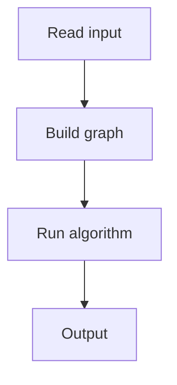

# 86. Monsters

## 1. Problem Description

Find a path from `A` to the boundary avoiding monsters `M`. Monsters move at the same speed. Output any valid path.

## 2. Expected Input

Grid with `A`, `M`, `.`, `#`.

## 3. Expected Output

Path or `NO`.

## 4. Constraints

1 <= n, m <= 1000.

## 5. Examples

| Input | Output |
|---|---|
| `5 8`<br>`########`<br>`#M..A..#`<br>`#.#.M###`<br>`#M..M..#`<br>`########` | `YES`<br>`5`<br>`RRDDR` |

## 6. Intuition

Multi-source BFS from all monsters to compute their distance to every cell. Then BFS from `A`, only moving to cells where `A`'s distance is less than the monster's distance.

## 7. Thought Process



## 8. Brute-Force Approach

None.

## 9. Optimized Solution

```python
from collections import deque

def solve(n, m, grid):
    monster_dist = [[-1] * m for _ in range(n)]
    q = deque()
    start = None
    for r in range(n):
        for c in range(m):
            if grid[r][c] == 'M':
                q.append((r, c))
                monster_dist[r][c] = 0
            if grid[r][c] == 'A':
                start = (r, c)
    # Multi-source BFS for monsters
    while q:
        r, c = q.popleft()
        for dr, dc in [(-1,0),(1,0),(0,-1),(0,1)]:
            nr, nc = r + dr, c + dc
            if 0 <= nr < n and 0 <= nc < m and grid[nr][nc] != '#' and monster_dist[nr][nc] == -1:
                monster_dist[nr][nc] = monster_dist[r][c] + 1
                q.append((nr, nc))
    # BFS from A
    visited = [[False] * m for _ in range(n)]
    parent = [[None] * m for _ in range(n)]
    q = deque([(start[0], start[1], 0)])
    visited[start[0]][start[1]] = True
    directions = [(-1,0,'U'),(1,0,'D'),(0,-1,'L'),(0,1,'R')]
    end = None
    while q:
        r, c, d = q.popleft()
        if r == 0 or r == n-1 or c == 0 or c == m-1:
            end = (r, c)
            break
        for dr, dc, dir in directions:
            nr, nc = r + dr, c + dc
            if 0 <= nr < n and 0 <= nc < m and grid[nr][nc] != '#' and not visited[nr][nc]:
                if monster_dist[nr][nc] == -1 or d + 1 < monster_dist[nr][nc]:
                    visited[nr][nc] = True
                    parent[nr][nc] = (r, c, dir)
                    q.append((nr, nc, d + 1))
    if not end:
        return None
    path = []
    r, c = end
    while (r, c) != start:
        pr, pc, d = parent[r][c]
        path.append(d)
        r, c = pr, pc
    return list(reversed(path))

if __name__ == "__main__":
    n, m = map(int, input().split())
    grid = [input().strip() for _ in range(n)]
    path = solve(n, m, grid)
    if path:
        print('YES')
        print(len(path))
        print(''.join(path))
    else:
        print('NO')
```

## 10. Why the Optimized Solution Works

Multi-source BFS computes the earliest arrival of any monster to each cell. A's BFS only moves to cells it can reach before any monster.

## 11. Algorithm Used

Multi-source BFS + conditional BFS.

## 12. Data Structures Used

Distance grid, queue.

## 13. Time Complexity Analysis

`O(n*m)`.

## 14. Space Complexity Analysis

`O(n*m)`.

## 15. Step-by-Step Code Walkthrough

1. BFS from all monsters. 2. BFS from A, only to cells where A arrives before monsters. 3. Reach boundary = escape.

## 16. Dry Run with Example

Skipped.

## 17. Common Pitfalls

- Starting A on the boundary. - Monsters reaching the same cell at the same time (A must be strictly faster).

## 18. Edge Cases

| A on boundary | 0 length |

## 19. Alternative Approaches

None.

## 20. Related Problems

[[85. Labyrinth]], [[84. Counting Rooms]]

## 21. Key Takeaways

- **Multi-source BFS** computes min distance from a set of sources. - Compare distances to determine safe cells.
