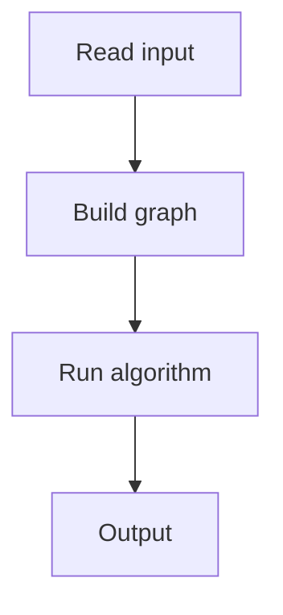

# 91. Building Roads

## 1. Problem Description

Given `n` cities and `m` roads, find the minimum number of new roads to connect all cities. Output the roads.

## 2. Expected Input

First line: `n, m`. Next `m` lines: `a, b`.

## 3. Expected Output

Minimum roads, then the road endpoints.

## 4. Constraints

1 <= n <= 10^5, 0 <= m <= 2*10^5.

## 5. Examples

| Input | Output |
|---|---|
| `4 2`<br>`1 2`<br>`3 4` | `1`<br>`2 3` |

## 6. Intuition

Find connected components. The answer is (number of components - 1). Connect any city from each consecutive component.

## 7. Thought Process



## 8. Brute-Force Approach

None.

## 9. Optimized Solution

```python
def solve(n, m, edges):
    adj = [[] for _ in range(n + 1)]
    for a, b in edges:
        adj[a].append(b)
        adj[b].append(a)
    visited = [False] * (n + 1)
    components = []
    for v in range(1, n + 1):
        if not visited[v]:
            comp = []
            stack = [v]
            visited[v] = True
            while stack:
                u = stack.pop()
                comp.append(u)
                for w in adj[u]:
                    if not visited[w]:
                        visited[w] = True
                        stack.append(w)
            components.append(comp)
    return components

if __name__ == "__main__":
    n, m = map(int, input().split())
    edges = []
    for _ in range(m):
        a, b = map(int, input().split())
        edges.append((a, b))
    comps = solve(n, m, edges)
    print(len(comps) - 1)
    for i in range(1, len(comps)):
        print(comps[0][0], comps[i][0])
```

## 10. Why the Optimized Solution Works

A spanning tree of the component graph needs (components - 1) edges. Connecting any node from each component suffices.

## 11. Algorithm Used

DFS for connected components.

## 12. Data Structures Used

Adjacency list, visited array.

## 13. Time Complexity Analysis

`O(n + m)`.

## 14. Space Complexity Analysis

`O(n + m)`.

## 15. Step-by-Step Code Walkthrough

1. DFS from each unvisited node to find components. 2. Connect component 0 to all others.

## 16. Dry Run with Example

Skipped.

## 17. Common Pitfalls

- 1-indexed nodes. - Disconnected graph with 0 edges.

## 18. Edge Cases

| n=1, m=0 | 0 roads |

## 19. Alternative Approaches

Union-Find.

## 20. Related Problems

[[92. Message Route]], [[93. Building Teams]]

## 21. Key Takeaways

- **DFS for connected components**. - Spanning tree needs `components - 1` edges.
