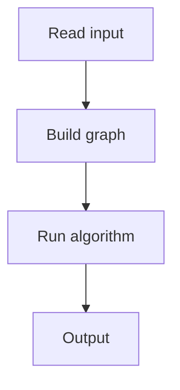

# 92. Message Route

## 1. Problem Description

Find the shortest path from node 1 to node n in an unweighted graph.

## 2. Expected Input

`n, m` and edges.

## 3. Expected Output

Path or `IMPOSSIBLE`.

## 4. Constraints

1 <= n <= 10^5.

## 5. Examples

| Input | Output |
|---|---|
| `5 5`<br>`1 2`<br>`1 3`<br>`1 4`<br>`2 3`<br>`5 4` | `3`<br>`1 4 5` |

## 6. Intuition

BFS from node 1. Track parent. Backtrack from node n.

## 7. Thought Process



## 8. Brute-Force Approach

DFS. Not shortest.

## 9. Optimized Solution

```python
from collections import deque

def solve(n, m, edges):
    adj = [[] for _ in range(n + 1)]
    for a, b in edges:
        adj[a].append(b)
        adj[b].append(a)
    parent = [-1] * (n + 1)
    q = deque([1])
    parent[1] = 0  # mark as visited with dummy parent
    while q:
        u = q.popleft()
        if u == n:
            break
        for v in adj[u]:
            if parent[v] == -1:
                parent[v] = u
                q.append(v)
    if parent[n] == -1:
        return None
    path = []
    v = n
    while v != 0:
        path.append(v)
        v = parent[v]
    return list(reversed(path))

if __name__ == "__main__":
    n, m = map(int, input().split())
    edges = [tuple(map(int, input().split())) for _ in range(m)]
    path = solve(n, m, edges)
    if path:
        print(len(path))
        print(*path)
    else:
        print('IMPOSSIBLE')
```

## 10. Why the Optimized Solution Works

BFS finds shortest path in unweighted graph. Parent tracking enables backtracking.

## 11. Algorithm Used

BFS + parent tracking.

## 12. Data Structures Used

Adjacency list, parent array, queue.

## 13. Time Complexity Analysis

`O(n + m)`.

## 14. Space Complexity Analysis

`O(n + m)`.

## 15. Step-by-Step Code Walkthrough

1. BFS from 1. 2. Backtrack from n using parent.

## 16. Dry Run with Example

Skipped.

## 17. Common Pitfalls

- Using DFS instead of BFS. - Not handling disconnected case.

## 18. Edge Cases

| 1 and n disconnected | IMPOSSIBLE |

## 19. Alternative Approaches

None.

## 20. Related Problems

[[91. Building Roads]], [[94. Round Trip]]

## 21. Key Takeaways

- **BFS for unweighted shortest path**. - Parent array for path recovery.
