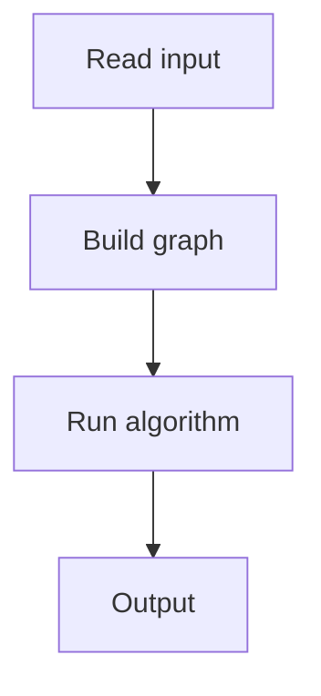

# 93. Building Teams

## 1. Problem Description

Divide `n` children into two teams such that no two friends are on the same team.

## 2. Expected Input

`n, m` and friendship edges.

## 3. Expected Output

Team assignment (1 or 2 per child), or `IMPOSSIBLE`.

## 4. Constraints

1 <= n <= 10^5.

## 5. Examples

| Input | Output |
|---|---|
| `5 3`<br>`1 2`<br>`1 3`<br>`4 5` | `1 2 2 1 2` |

## 6. Intuition

Bipartite graph check via BFS coloring. Assign alternating colors (teams) to neighbors.

## 7. Thought Process



## 8. Brute-Force Approach

Try all 2^n assignments.

## 9. Optimized Solution

```python
from collections import deque

def solve(n, m, edges):
    adj = [[] for _ in range(n + 1)]
    for a, b in edges:
        adj[a].append(b)
        adj[b].append(a)
    color = [0] * (n + 1)  # 0 = uncolored, 1, 2 = teams
    for start in range(1, n + 1):
        if color[start] != 0:
            continue
        q = deque([start])
        color[start] = 1
        while q:
            u = q.popleft()
            for v in adj[u]:
                if color[v] == 0:
                    color[v] = 3 - color[u]  # flip 1<->2
                    q.append(v)
                elif color[v] == color[u]:
                    return None
    return color[1:]

if __name__ == "__main__":
    n, m = map(int, input().split())
    edges = [tuple(map(int, input().split())) for _ in range(m)]
    result = solve(n, m, edges)
    if result:
        print(*result)
    else:
        print('IMPOSSIBLE')
```

## 10. Why the Optimized Solution Works

A graph is bipartite iff it has no odd cycle. BFS coloring assigns alternating colors; if a conflict arises, the graph isn't bipartite.

## 11. Algorithm Used

BFS bipartite check.

## 12. Data Structures Used

Color array, queue.

## 13. Time Complexity Analysis

`O(n + m)`.

## 14. Space Complexity Analysis

`O(n + m)`.

## 15. Step-by-Step Code Walkthrough

1. For each uncolored node: BFS, assign alternating colors. 2. If conflict, return IMPOSSIBLE.

## 16. Dry Run with Example

Skipped.

## 17. Common Pitfalls

- Not checking all components. - Wrong color flip.

## 18. Edge Cases

| Disconnected graph | Each component colored independently |

## 19. Alternative Approaches

DFS coloring.

## 20. Related Problems

[[91. Building Roads]], [[95. Shortest Routes I]]

## 21. Key Takeaways

- **Bipartite check** = 2-coloring. - BFS assigns alternating colors. Conflict means odd cycle.
