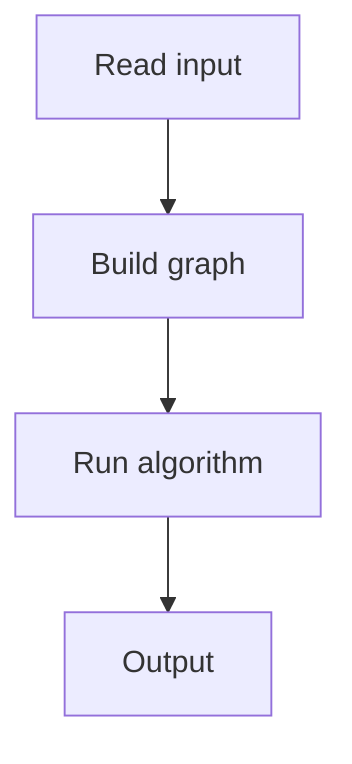

# 95. Shortest Routes I

## 1. Problem Description

Find shortest distances from node 1 to all other nodes in a weighted graph (non-negative weights).

## 2. Expected Input

`n, m` and weighted edges.

## 3. Expected Output

Shortest distances from node 1.

## 4. Constraints

1 <= n <= 10^5, weights up to 10^9.

## 5. Examples

| Input | Output |
|---|---|
| `5 5`<br>`1 2 5`...| `0 5 7 8 13` |

## 6. Intuition

Dijkstra's algorithm with a min-heap.

## 7. Thought Process



## 8. Brute-Force Approach

Bellman-Ford. `O(n*m)`.

## 9. Optimized Solution

```python
import heapq

def solve(n, m, edges):
    adj = [[] for _ in range(n + 1)]
    for a, b, w in edges:
        adj[a].append((b, w))
    dist = [float('inf')] * (n + 1)
    dist[1] = 0
    pq = [(0, 1)]
    while pq:
        d, u = heapq.heappop(pq)
        if d > dist[u]:
            continue
        for v, w in adj[u]:
            if dist[v] > d + w:
                dist[v] = d + w
                heapq.heappush(pq, (dist[v], v))
    return dist[1:]

if __name__ == "__main__":
    n, m = map(int, input().split())
    edges = [tuple(map(int, input().split())) for _ in range(m)]
    print(*solve(n, m, edges))
```

## 10. Why the Optimized Solution Works

Dijkstra greedily extracts the closest unprocessed node. Min-heap gives `O(log n)` extraction.

## 11. Algorithm Used

Dijkstra.

## 12. Data Structures Used

Min-heap, adjacency list.

## 13. Time Complexity Analysis

`O((n+m) log n)`.

## 14. Space Complexity Analysis

`O(n + m)`.

## 15. Step-by-Step Code Walkthrough

1. `dist[1] = 0`, push (0, 1). 2. Pop min, relax neighbors. 3. Skip if already processed.

## 16. Dry Run with Example

Skipped.

## 17. Common Pitfalls

- Not skipping outdated heap entries. - Negative weights (use Bellman-Ford).

## 18. Edge Cases

| Disconnected | inf |

## 19. Alternative Approaches

Bellman-Ford for negative weights.

## 20. Related Problems

[[96. Shortest Routes II]], [[87. Flight Discount]]

## 21. Key Takeaways

- **Dijkstra** for non-negative weights. - Skip outdated entries (`d > dist[u]`). - Min-heap for efficient extraction.
