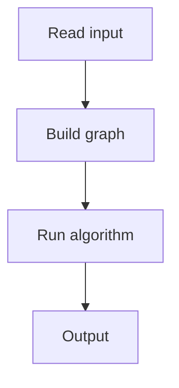

# 96. Shortest Routes II

## 1. Problem Description

Find shortest distances between all pairs of nodes.

## 2. Expected Input

`n, m, q` and edges, then `q` queries.

## 3. Expected Output

Distance for each query, or -1.

## 4. Constraints

1 <= n <= 500.

## 5. Examples

| Input | Output |
|---|---|
| `4 3 5`...| `...` |

## 6. Intuition

Floyd-Warshall: `dist[i][j] = min(dist[i][j], dist[i][k] + dist[k][j])` for all `k`.

## 7. Thought Process



## 8. Brute-Force Approach

Dijkstra from each node. `O(n * (n+m) log n)`.

## 9. Optimized Solution

```python
def solve(n, m, edges, queries):
    INF = float('inf')
    dist = [[INF] * (n + 1) for _ in range(n + 1)]
    for i in range(1, n + 1):
        dist[i][i] = 0
    for a, b, w in edges:
        dist[a][b] = min(dist[a][b], w)
        dist[b][a] = min(dist[b][a], w)
    for k in range(1, n + 1):
        for i in range(1, n + 1):
            for j in range(1, n + 1):
                if dist[i][k] + dist[k][j] < dist[i][j]:
                    dist[i][j] = dist[i][k] + dist[k][j]
    results = []
    for a, b in queries:
        results.append(dist[a][b] if dist[a][b] != INF else -1)
    return results

if __name__ == "__main__":
    n, m, q = map(int, input().split())
    edges = [tuple(map(int, input().split())) for _ in range(m)]
    queries = [tuple(map(int, input().split())) for _ in range(q)]
    for r in solve(n, m, edges, queries):
        print(r)
```

## 10. Why the Optimized Solution Works

Floyd-Warshall considers each node `k` as an intermediate and updates all pairs.

## 11. Algorithm Used

Floyd-Warshall.

## 12. Data Structures Used

2D distance matrix.

## 13. Time Complexity Analysis

`O(n^3)`.

## 14. Space Complexity Analysis

`O(n^2)`.

## 15. Step-by-Step Code Walkthrough

1. Initialize distances. 2. For each `k`: relax all pairs via `k`.

## 16. Dry Run with Example

Skipped.

## 17. Common Pitfalls

- Loop order (k must be outermost). - INF handling.

## 18. Edge Cases

| No path | -1 |

## 19. Alternative Approaches

Dijkstra from each node.

## 20. Related Problems

[[95. Shortest Routes I]], [[97. High Score]]

## 21. Key Takeaways

- **Floyd-Warshall** for all-pairs shortest paths. - Loop order: `k, i, j` (k outermost). - `O(n^3)`, suitable for n <= 500.
