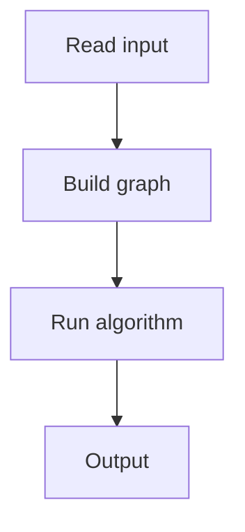

# 98. Road Reparation

## 1. Problem Description

Find the minimum cost to connect all cities with roads.

## 2. Expected Input

`n, m` and weighted edges.

## 3. Expected Output

Minimum cost, or `IMPOSSIBLE`.

## 4. Constraints

1 <= n <= 10^5.

## 5. Examples

| Input | Output |
|---|---|
| `5 6`...| `...` |

## 6. Intuition

Minimum spanning tree (MST) via Kruskal's algorithm with Union-Find.

## 7. Thought Process



## 8. Brute-Force Approach

Try all spanning trees. Exponential.

## 9. Optimized Solution

```python
class DSU:
    def __init__(self, n):
        self.parent = list(range(n + 1))
        self.rank = [0] * (n + 1)
    def find(self, x):
        if self.parent[x] != x:
            self.parent[x] = self.find(self.parent[x])
        return self.parent[x]
    def union(self, x, y):
        px, py = self.find(x), self.find(y)
        if px == py: return False
        if self.rank[px] < self.rank[py]: px, py = py, px
        self.parent[py] = px
        if self.rank[px] == self.rank[py]: self.rank[px] += 1
        return True

def solve(n, m, edges):
    edges.sort(key=lambda e: e[2])
    dsu = DSU(n)
    cost = 0
    count = 0
    for a, b, w in edges:
        if dsu.union(a, b):
            cost += w
            count += 1
            if count == n - 1:
                return cost
    return None

if __name__ == "__main__":
    n, m = map(int, input().split())
    edges = [tuple(map(int, input().split())) for _ in range(m)]
    result = solve(n, m, edges)
    print(result if result is not None else 'IMPOSSIBLE')
```

## 10. Why the Optimized Solution Works

Kruskal sorts edges by weight and adds them if they connect different components (no cycle). Union-Find tracks components efficiently.

## 11. Algorithm Used

Kruskal + Union-Find.

## 12. Data Structures Used

DSU, sorted edges.

## 13. Time Complexity Analysis

`O(m log m)`.

## 14. Space Complexity Analysis

`O(n + m)`.

## 15. Step-by-Step Code Walkthrough

1. Sort edges by weight. 2. For each edge: if it connects two different components, add it. 3. Stop after `n-1` edges.

## 16. Dry Run with Example

Skipped.

## 17. Common Pitfalls

- Path compression missing. - Not stopping early.

## 18. Edge Cases

| Disconnected | IMPOSSIBLE |

## 19. Alternative Approaches

Prim's algorithm.

## 20. Related Problems

[[99. Road Construction]], [[95. Shortest Routes I]]

## 21. Key Takeaways

- **Kruskal** = sort edges + Union-Find. - MST has `n-1` edges. - Union-Find with path compression is `O(alpha(n))` per operation.
