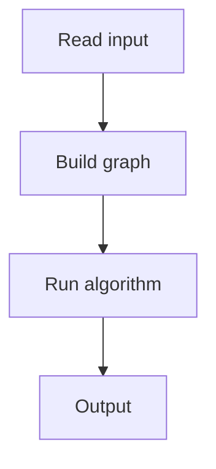

# 122. Static Range Sum Queries

## 1. Problem Description

Answer `q` queries: sum of `arr[a..b]`.

## 2. Expected Input

`n, q`, array, then queries.

## 3. Expected Output

Sum for each query.

## 4. Constraints

Up to 2*10^5.

## 5. Examples

| Input | Output |
|---|---|
| `8 4`...| `...` |

## 6. Intuition

Prefix sums. `sum(a..b) = prefix[b] - prefix[a-1]`.

## 7. Thought Process



## 8. Brute-Force Approach

`O(n)` per query.

## 9. Optimized Solution

```python
def solve(n, q, arr, queries):
    prefix = [0] * (n + 1)
    for i in range(n):
        prefix[i + 1] = prefix[i] + arr[i]
    results = []
    for a, b in queries:
        results.append(prefix[b] - prefix[a - 1])
    return results

if __name__ == "__main__":
    n, q = map(int, input().split())
    arr = list(map(int, input().split()))
    queries = [tuple(map(int, input().split())) for _ in range(q)]
    for r in solve(n, q, arr, queries):
        print(r)
```

## 10. Why the Optimized Solution Works

Prefix sums precompute cumulative sums, enabling O(1) range sum queries.

## 11. Algorithm Used

Prefix sums.

## 12. Data Structures Used

Prefix sum array.

## 13. Time Complexity Analysis

`O(n + q)`.

## 14. Space Complexity Analysis

`O(n)`.

## 15. Step-by-Step Code Walkthrough

1. Build prefix array. 2. For each query: `prefix[b] - prefix[a-1]`.

## 16. Dry Run with Example

Skipped.

## 17. Common Pitfalls

- 1-indexed queries. - Off-by-one.

## 18. Edge Cases

| Single element | That element |

## 19. Alternative Approaches

Segment tree (overkill).

## 20. Related Problems

[[123. Static Range Minimum Queries]], [[124. Dynamic Range Sum Queries]]

## 21. Key Takeaways

- **Prefix sums** for static range sum queries. - `O(n)` preprocessing, `O(1)` per query.
