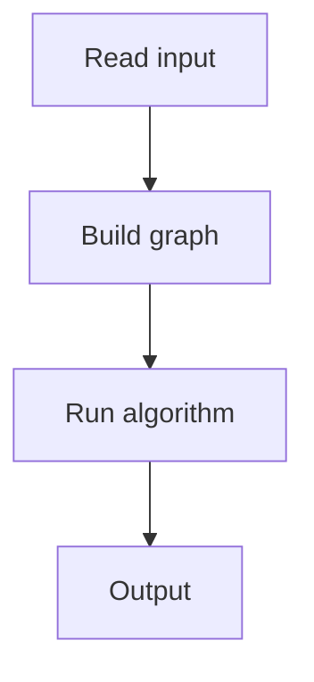

# 123. Static Range Minimum Queries

## 1. Problem Description

Answer range minimum queries.

## 2. Expected Input

Same as static range sum.

## 3. Expected Output

Min for each query.

## 4. Constraints

Up to 2*10^5.

## 5. Examples

| Input | Output |
|---|---|
| `8 4`...| `...` |

## 6. Intuition

Sparse table: `st[k][i]` = min of range `[i, i + 2^k - 1]`. `O(1)` queries via overlapping ranges.

## 7. Thought Process



## 8. Brute-Force Approach

`O(n)` per query.

## 9. Optimized Solution

```python
import math

def solve(n, q, arr, queries):
    LOG = max(1, (n).bit_length())
    st = [[0] * n for _ in range(LOG)]
    st[0] = arr[:]
    for k in range(1, LOG):
        for i in range(n - (1 << k) + 1):
            st[k][i] = min(st[k-1][i], st[k-1][i + (1 << (k-1))])
    results = []
    for a, b in queries:
        a -= 1; b -= 1
        length = b - a + 1
        k = length.bit_length() - 1
        results.append(min(st[k][a], st[k][b - (1 << k) + 1]))
    return results

if __name__ == "__main__":
    n, q = map(int, input().split())
    arr = list(map(int, input().split()))
    queries = [tuple(map(int, input().split())) for _ in range(q)]
    for r in solve(n, q, arr, queries):
        print(r)
```

## 10. Why the Optimized Solution Works

Sparse table precomputes min for all power-of-2 length ranges. A query is answered by two overlapping ranges.

## 11. Algorithm Used

Sparse table.

## 12. Data Structures Used

2D table.

## 13. Time Complexity Analysis

`O(n log n)` preprocessing, `O(1)` per query.

## 14. Space Complexity Analysis

`O(n log n)`.

## 15. Step-by-Step Code Walkthrough

1. `st[0][i] = arr[i]`. 2. `st[k][i] = min(st[k-1][i], st[k-1][i + 2^(k-1)])`. 3. Query: two overlapping ranges of length 2^k.

## 16. Dry Run with Example

Skipped.

## 17. Common Pitfalls

- Index handling (1-indexed to 0-indexed). - k computation.

## 18. Edge Cases

| Single element | That element |

## 19. Alternative Approaches

Segment tree (supports updates).

## 20. Related Problems

[[122. Static Range Sum Queries]], [[124. Dynamic Range Minimum Queries]]

## 21. Key Takeaways

- **Sparse table** for immutable range min/max. - `O(n log n)` preprocessing, `O(1)` queries. - Overlapping ranges cover any length.
