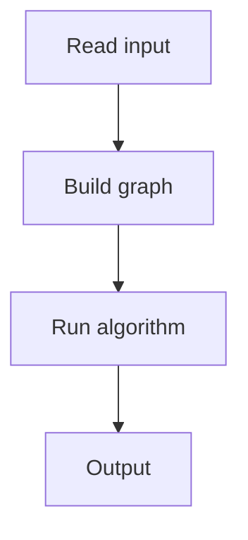

# 124. Dynamic Range Sum Queries

## 1. Problem Description

Support point updates and range sum queries.

## 2. Expected Input

`n, q`, array, then updates/queries.

## 3. Expected Output

Sum for each query.

## 4. Constraints

Up to 2*10^5.

## 5. Examples

| Input | Output |
|---|---|
| `8 4`...| `...` |

## 6. Intuition

Fenwick tree (Binary Indexed Tree). `O(log n)` updates and queries.

## 7. Thought Process



## 8. Brute-Force Approach

`O(n)` per update.

## 9. Optimized Solution

```python
class Fenwick:
    def __init__(self, n):
        self.n = n
        self.tree = [0] * (n + 1)
    def update(self, i, delta):
        while i <= self.n:
            self.tree[i] += delta
            i += i & (-i)
    def query(self, i):
        s = 0
        while i > 0:
            s += self.tree[i]
            i -= i & (-i)
        return s
    def range_sum(self, a, b):
        return self.query(b) - self.query(a - 1)

def solve(n, q, arr, ops):
    ft = Fenwick(n)
    for i, x in enumerate(arr, 1):
        ft.update(i, x)
    results = []
    for op in ops:
        if op[0] == 1:
            k, x = op[1], op[2]
            # Update: set arr[k] to x
            current = ft.range_sum(k, k)
            ft.update(k, x - current)
        else:
            a, b = op[1], op[2]
            results.append(ft.range_sum(a, b))
    return results

if __name__ == "__main__":
    n, q = map(int, input().split())
    arr = list(map(int, input().split()))
    ops = []
    for _ in range(q):
        ops.append(tuple(map(int, input().split())))
    for r in solve(n, q, arr, ops):
        print(r)
```

## 10. Why the Optimized Solution Works

Fenwick tree uses the binary representation of indices to compute prefix sums in `O(log n)`. Updates propagate to ancestors.

## 11. Algorithm Used

Fenwick tree (BIT).

## 12. Data Structures Used

1D tree array.

## 13. Time Complexity Analysis

`O(log n)` per operation.

## 14. Space Complexity Analysis

`O(n)`.

## 15. Step-by-Step Code Walkthrough

1. Build tree by updating each element. 2. Update: add delta, propagate. 3. Query: prefix sum via `i & (-i)`.

## 16. Dry Run with Example

Skipped.

## 17. Common Pitfalls

- 1-indexed. - Update vs set (need to compute delta).

## 18. Edge Cases

| Single element | Works |

## 19. Alternative Approaches

Segment tree.

## 20. Related Problems

[[122. Static Range Sum Queries]], [[125. Dynamic Range Minimum Queries]]

## 21. Key Takeaways

- **Fenwick tree** for point updates + range sums. - `i & (-i)` gives the lowest set bit. - `O(log n)` for both operations.
