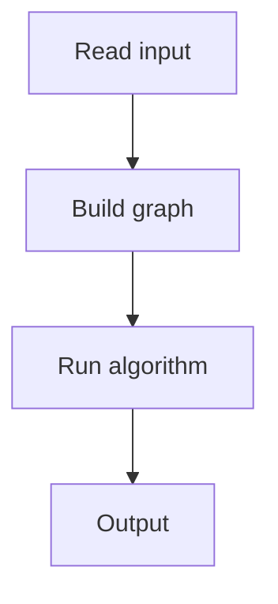

# 130. Distinct Values Queries

## 1. Problem Description

Answer queries: number of distinct values in `arr[a..b]`.

## 2. Expected Input

`n, q`, array, queries.

## 3. Expected Output

Distinct count per query.

## 4. Constraints

Up to 2*10^5.

## 5. Examples

| Input | Output |
|---|---|
| `8 4`...| `...` |

## 6. Intuition

Mo's algorithm: sort queries by block, sweep with two pointers, maintain a frequency map.

## 7. Thought Process



## 8. Brute-Force Approach

`O(n)` per query.

## 9. Optimized Solution

```python
import math

def solve(n, q, arr, queries):
    block_size = int(math.sqrt(n))
    # Sort queries by (block of L, R)
    indexed_queries = [(a, b, i) for i, (a, b) in enumerate(queries)]
    indexed_queries.sort(key=lambda x: (x[0] // block_size, x[1] if (x[0] // block_size) % 2 == 0 else -x[1]))
    
    freq = {}
    distinct = 0
    cur_l, cur_r = 1, 0  # current range [cur_l, cur_r]
    
    results = [0] * q
    
    def add(pos):
        nonlocal distinct
        v = arr[pos - 1]
        freq[v] = freq.get(v, 0) + 1
        if freq[v] == 1:
            distinct += 1
    
    def remove(pos):
        nonlocal distinct
        v = arr[pos - 1]
        freq[v] -= 1
        if freq[v] == 0:
            distinct -= 1
    
    for a, b, idx in indexed_queries:
        while cur_l > a:
            cur_l -= 1
            add(cur_l)
        while cur_r < b:
            cur_r += 1
            add(cur_r)
        while cur_l < a:
            remove(cur_l)
            cur_l += 1
        while cur_r > b:
            remove(cur_r)
            cur_r -= 1
        results[idx] = distinct
    
    return results

if __name__ == "__main__":
    n, q = map(int, input().split())
    arr = list(map(int, input().split()))
    queries = [tuple(map(int, input().split())) for _ in range(q)]
    for r in solve(n, q, arr, queries):
        print(r)
```

## 10. Why the Optimized Solution Works

Mo's algorithm processes queries in a specific order to minimize pointer movements. Each query moves pointers by `O(sqrt(n))` on average.

## 11. Algorithm Used

Mo's algorithm.

## 12. Data Structures Used

Frequency map, two pointers.

## 13. Time Complexity Analysis

`O((n + q) * sqrt(n))`.

## 14. Space Complexity Analysis

`O(n)`.

## 15. Step-by-Step Code Walkthrough

1. Sort queries by block of L, then R. 2. Sweep with two pointers, maintaining frequency map and distinct count.

## 16. Dry Run with Example

Skipped.

## 17. Common Pitfalls

- Sort order (alternate R direction for cache efficiency). - Pointer movement order.

## 18. Edge Cases

| Single element | 1 |

## 19. Alternative Approaches

Persistent segment tree, offline with BIT.

## 20. Related Problems

[[124. Dynamic Range Sum Queries]], [[152. Distinct Colors]]

## 21. Key Takeaways

- **Mo's algorithm** for offline range queries. - Sort by block, sweep with two pointers. - `O((n+q) sqrt(n))`.
