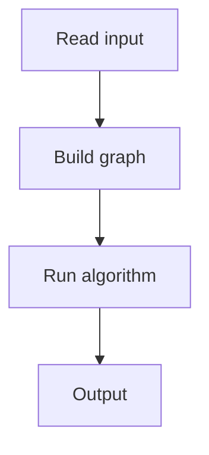

# 145. Tree Diameter

## 1. Problem Description

Find the diameter (longest path) of a tree.

## 2. Expected Input

`n` and `n-1` edges.

## 3. Expected Output

Diameter length.

## 4. Constraints

Up to 2*10^5.

## 5. Examples

| Input | Output |
|---|---|
| `5`...| `3` |

## 6. Intuition

Two BFS/DFS: from any node, find the farthest node `u`. From `u`, find the farthest node `v`. The distance is the diameter.

## 7. Thought Process



## 8. Brute-Force Approach

All pairs. `O(n^2)`.

## 9. Optimized Solution

```python
from collections import deque

def bfs(n, adj, start):
    dist = [-1] * (n + 1)
    dist[start] = 0
    q = deque([start])
    farthest = start
    while q:
        u = q.popleft()
        for v in adj[u]:
            if dist[v] == -1:
                dist[v] = dist[u] + 1
                q.append(v)
                if dist[v] > dist[farthest]:
                    farthest = v
    return farthest, dist[farthest]

def solve(n, edges):
    adj = [[] for _ in range(n + 1)]
    for a, b in edges:
        adj[a].append(b)
        adj[b].append(a)
    u, _ = bfs(n, adj, 1)
    _, diam = bfs(n, adj, u)
    return diam

if __name__ == "__main__":
    n = int(input())
    edges = [tuple(map(int, input().split())) for _ in range(n - 1)]
    print(solve(n, edges))
```

## 10. Why the Optimized Solution Works

In a tree, the farthest node from any node is one endpoint of the diameter. The farthest from that endpoint is the other endpoint.

## 11. Algorithm Used

Two BFS.

## 12. Data Structures Used

Adjacency list.

## 13. Time Complexity Analysis

`O(n)`.

## 14. Space Complexity Analysis

`O(n)`.

## 15. Step-by-Step Code Walkthrough

1. BFS from node 1 to find `u`. 2. BFS from `u` to find `v`. 3. Distance `u` to `v` is the diameter.

## 16. Dry Run with Example

Skipped.

## 17. Common Pitfalls

- Using DFS (may stack overflow). - Wrong starting node.

## 18. Edge Cases

| n=1 | 0 |

## 19. Alternative Approaches

Tree DP.

## 20. Related Problems

[[146. Tree Distances I]], [[148. Distance Queries]]

## 21. Key Takeaways

- **Two BFS** for tree diameter. - Farthest from any node is a diameter endpoint. - `O(n)`.
