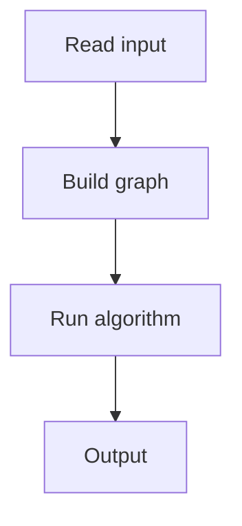

# 148. Distance Queries

## 1. Problem Description

Answer queries: distance between nodes `a` and `b` in a tree.

## 2. Expected Input

`n, q`, edges, queries.

## 3. Expected Output

Distance per query.

## 4. Constraints

Up to 2*10^5.

## 5. Examples

| Input | Output |
|---|---|
| `5 3`...| `...` |

## 6. Intuition

`dist(a, b) = depth[a] + depth[b] - 2 * depth[lca(a, b)]`. Use binary lifting for LCA.

## 7. Thought Process



## 8. Brute-Force Approach

`O(n)` per query (walk up).

## 9. Optimized Solution

```python
def solve(n, edges, queries):
    LOG = max(1, (n).bit_length())
    adj = [[] for _ in range(n + 1)]
    for a, b in edges:
        adj[a].append(b)
        adj[b].append(a)
    
    depth = [0] * (n + 1)
    parent = [[0] * (n + 1) for _ in range(LOG)]
    
    # BFS to compute depth and parent[0]
    from collections import deque
    q = deque([1])
    parent[0][1] = 1
    visited = [False] * (n + 1)
    visited[1] = True
    while q:
        u = q.popleft()
        for v in adj[u]:
            if not visited[v]:
                visited[v] = True
                parent[0][v] = u
                depth[v] = depth[u] + 1
                q.append(v)
    
    # Binary lifting table
    for k in range(1, LOG):
        for v in range(1, n + 1):
            parent[k][v] = parent[k-1][parent[k-1][v]]
    
    def lca(a, b):
        if depth[a] < depth[b]:
            a, b = b, a
        diff = depth[a] - depth[b]
        for k in range(LOG):
            if diff & (1 << k):
                a = parent[k][a]
        if a == b:
            return a
        for k in range(LOG - 1, -1, -1):
            if parent[k][a] != parent[k][b]:
                a = parent[k][a]
                b = parent[k][b]
        return parent[0][a]
    
    results = []
    for a, b in queries:
        l = lca(a, b)
        results.append(depth[a] + depth[b] - 2 * depth[l])
    return results

if __name__ == "__main__":
    n, q = map(int, input().split())
    edges = [tuple(map(int, input().split())) for _ in range(n - 1)]
    queries = [tuple(map(int, input().split())) for _ in range(q)]
    for r in solve(n, edges, queries):
        print(r)
```

## 10. Why the Optimized Solution Works

Binary lifting precomputes `2^k`-th ancestors. LCA is found by bringing both nodes to the same depth, then jumping up together.

## 11. Algorithm Used

LCA via binary lifting.

## 12. Data Structures Used

2D parent table.

## 13. Time Complexity Analysis

`O(n log n)` preprocessing, `O(log n)` per query.

## 14. Space Complexity Analysis

`O(n log n)`.

## 15. Step-by-Step Code Walkthrough

1. BFS for depth and immediate parent. 2. Build binary lifting table. 3. LCA: equalize depth, jump together. 4. Distance = `depth[a] + depth[b] - 2*depth[lca]`.

## 16. Dry Run with Example

Skipped.

## 17. Common Pitfalls

- Root choice (node 1 here). - Binary lifting loop direction.

## 18. Edge Cases

| a == b | 0 |

## 19. Alternative Approaches

Euler tour + sparse table for `O(1)` queries.

## 20. Related Problems

[[145. Tree Diameter]], [[149. Counting Paths]]

## 21. Key Takeaways

- **Binary lifting** for LCA. - `dist(a, b) = depth[a] + depth[b] - 2*depth[lca]`. - `O(n log n)` preprocessing, `O(log n)` per query.
