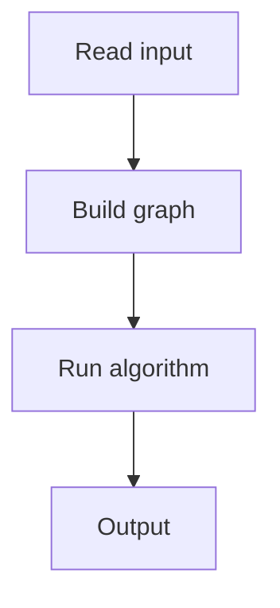

# 152. Distinct Colors

## 1. Problem Description

For each subtree, count the number of distinct colors.

## 2. Expected Input

`n` colors, then `n-1` edges.

## 3. Expected Output

Distinct count per node.

## 4. Constraints

Up to 2*10^5.

## 5. Examples

| Input | Output |
|---|---|
| `5`...| `3 2 1 1 1` |

## 6. Intuition

DSU on tree (Sack): process light children first (clear), then heavy child (keep), then merge light children into heavy.

## 7. Thought Process



## 8. Brute-Force Approach

`O(n^2)`.

## 9. Optimized Solution

```python
import sys
sys.setrecursionlimit(300000)

def solve(n, colors, edges):
    adj = [[] for _ in range(n + 1)]
    for a, b in edges:
        adj[a].append(b)
        adj[b].append(a)
    
    # Find heavy child for each node
    size = [0] * (n + 1)
    heavy = [0] * (n + 1)
    
    def dfs_size(u, p):
        size[u] = 1
        max_size = 0
        for v in adj[u]:
            if v != p:
                dfs_size(v, u)
                size[u] += size[v]
                if size[v] > max_size:
                    max_size = size[v]
                    heavy[u] = v
    
    dfs_size(1, 0)
    
    color_count = {}
    distinct = 0
    answer = [0] * (n + 1)
    
    def add(u, p, skip):
        nonlocal distinct
        c = colors[u - 1]
        color_count[c] = color_count.get(c, 0) + 1
        if color_count[c] == 1:
            distinct += 1
        for v in adj[u]:
            if v != p and v != skip:
                add(v, u, 0)
    
    def remove(u, p):
        nonlocal distinct
        c = colors[u - 1]
        color_count[c] -= 1
        if color_count[c] == 0:
            distinct -= 1
        for v in adj[u]:
            if v != p:
                remove(v, u)
    
    def dfs(u, p, keep):
        for v in adj[u]:
            if v != p and v != heavy[u]:
                dfs(v, u, False)
        if heavy[u]:
            dfs(heavy[u], u, True)
        add(u, p, heavy[u])
        answer[u] = distinct
        if not keep:
            remove(u, p)
    
    dfs(1, 0, True)
    return answer[1:]

if __name__ == "__main__":
    n = int(input())
    colors = list(map(int, input().split()))
    edges = [tuple(map(int, input().split())) for _ in range(n - 1)]
    print(*solve(n, colors, edges))
```

## 10. Why the Optimized Solution Works

DSU on tree processes heavy children last and keeps their data, avoiding recomputation. Light children are cleared after use.

## 11. Algorithm Used

DSU on tree (Sack).

## 12. Data Structures Used

Color count map.

## 13. Time Complexity Analysis

`O(n log n)`.

## 14. Space Complexity Analysis

`O(n)`.

## 15. Step-by-Step Code Walkthrough

1. Find heavy child (largest subtree). 2. DFS: process light children first (clear), then heavy (keep), then add current. 3. Answer = distinct count.

## 16. Dry Run with Example

Skipped.

## 17. Common Pitfalls

- Recursion depth. - Order of processing.

## 18. Edge Cases

| All same color | 1 per node |

## 19. Alternative Approaches

Mo's on trees.

## 20. Related Problems

[[150. Subtree Queries]], [[130. Distinct Values Queries]]

## 21. Key Takeaways

- **DSU on tree** for subtree queries. - Process light children first (clear), heavy last (keep). - `O(n log n)`.
