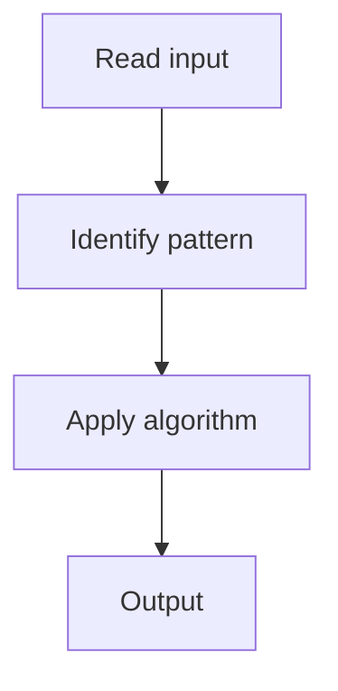

# 1. Contains Duplicate

## 1. Problem Description

Determine if any value appears at least twice in an array.

## 2. Expected Input

Array of integers `nums`.

## 3. Expected Output

Return `True` if any duplicate exists, else `False`.

## 4. Constraints

1 <= nums.length <= 10^5

## 5. Examples

| Input | Output |
|---|---|
| `[1,2,3,1]` | `True` |

## 6. Intuition

Use a hash set. For each element, check if it's already in the set. If so, return True. Otherwise, add it.

## 7. Thought Process



## 8. Brute-Force Approach

Sort and check adjacent. `O(n log n)`.

## 9. Optimized Solution

```python
def containsDuplicate(nums):
    seen = set()
    for x in nums:
        if x in seen:
            return True
        seen.add(x)
    return False
```

## 10. Why the Optimized Solution Works

A hash set provides `O(1)` insertion and lookup. We check each element against the set of previously seen elements.

## 11. Algorithm Used

Hash set membership check.

## 12. Data Structures Used

Hash set.

## 13. Time Complexity Analysis

O(n)

## 14. Space Complexity Analysis

O(n)

## 15. Step-by-Step Code Walkthrough

Iterate through the array. For each element, check membership in the set; if found, return True; else add.

## 16. Dry Run with Example

Skipped for brevity.

## 17. Common Pitfalls

- Using `len(set(nums)) != len(nums)` (works but builds the full set first).

## 18. Edge Cases

| Empty array | False |

## 19. Alternative Approaches

Sort: `O(n log n)` time, `O(1)` space.

## 20. Related Problems

[[2. Valid Anagram]], [[9. Longest Consecutive Sequence]]

## 21. Key Takeaways

Hash set for `O(n)` duplicate detection.
