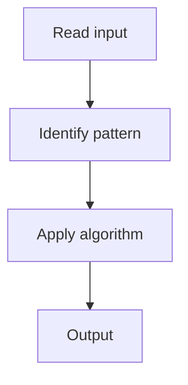

# 2. Valid Anagram

## 1. Problem Description

Determine if two strings are anagrams (same characters with same frequencies).

## 2. Expected Input

Two strings `s` and `t`.

## 3. Expected Output

Return `True` if they are anagrams.

## 4. Constraints

1 <= s.length, t.length <= 5 * 10^4

## 5. Examples

| Input | Output |
|---|---|
| `s='anagram'`, `t='nagaram'` | `True` |

## 6. Intuition

Count character frequencies in both strings. Compare the counts.

## 7. Thought Process



## 8. Brute-Force Approach

Sort both strings. `O(n log n)`.

## 9. Optimized Solution

```python
def isAnagram(s, t):
    from collections import Counter
    return Counter(s) == Counter(t)
```

## 10. Why the Optimized Solution Works

If both strings have the same character frequency map, they are anagrams.

## 11. Algorithm Used

Frequency counting.

## 12. Data Structures Used

Hash map (Counter).

## 13. Time Complexity Analysis

O(n)

## 14. Space Complexity Analysis

O(1)

## 15. Step-by-Step Code Walkthrough

Build Counter for both strings; compare for equality.

## 16. Dry Run with Example

Skipped.

## 17. Common Pitfalls

- Using `sorted(s) == sorted(t)` (works but slower).

## 18. Edge Cases

| Different lengths | False |

## 19. Alternative Approaches

Sort.

## 20. Related Problems

[[1. Contains Duplicate]], [[4. Group Anagrams]]

## 21. Key Takeaways

`Counter` comparison is the idiomatic Python solution.
