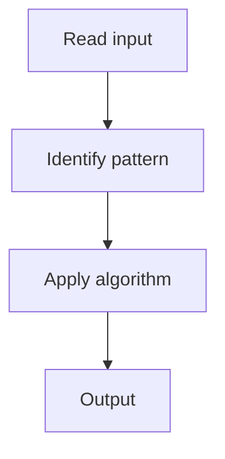

# 3. Two Sum

## 1. Problem Description

Find two indices `i, j` such that `nums[i] + nums[j] == target`.

## 2. Expected Input

Array `nums` and integer `target`.

## 3. Expected Output

Return `[i, j]`.

## 4. Constraints

2 <= nums.length <= 10^4

## 5. Examples

| Input | Output |
|---|---|
| `nums=[2,7,11,15]`, `target=9` | `[0,1]` |

## 6. Intuition

Hash map from value to index. For each element, check if `target - value` is in the map.

## 7. Thought Process



## 8. Brute-Force Approach

Check all pairs. `O(n^2)`.

## 9. Optimized Solution

```python
def twoSum(nums, target):
    seen = {}
    for i, x in enumerate(nums):
        if target - x in seen:
            return [seen[target - x], i]
        seen[x] = i
```

## 10. Why the Optimized Solution Works

The complement of each element, if seen before, forms a valid pair.

## 11. Algorithm Used

Hash map.

## 12. Data Structures Used

Hash map.

## 13. Time Complexity Analysis

O(n)

## 14. Space Complexity Analysis

O(n)

## 15. Step-by-Step Code Walkthrough

For each element, check complement; if found, return; else store.

## 16. Dry Run with Example

Skipped.

## 17. Common Pitfalls

- Using the same element twice (avoided by checking before storing).

## 18. Edge Cases

| Exactly one pair exists | Guaranteed |

## 19. Alternative Approaches

Sort + two pointers (loses indices).

## 20. Related Problems

[[41. Sum of Two Values]], [[2. Two Sum II - Input Array Is Sorted]]

## 21. Key Takeaways

Hash map for `O(n)` two-sum.
