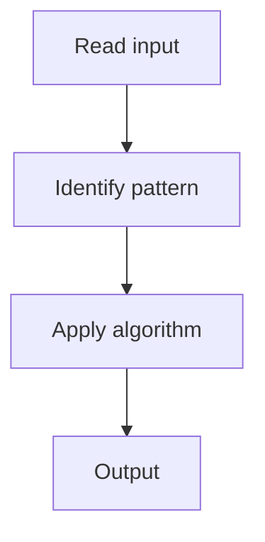

# 4. Group Anagrams

## 1. Problem Description

Group strings that are anagrams of each other.

## 2. Expected Input

Array of strings `strs`.

## 3. Expected Output

Return list of groups.

## 4. Constraints

1 <= strs.length <= 10^4

## 5. Examples

| Input | Output |
|---|---|
| `["eat","tea","tan","ate","nat","bat"]` | `[["eat","tea","ate"],["tan","nat"],["bat"]]` |

## 6. Intuition

Use the sorted string as a key in a hash map. Anagrams have the same sorted form.

## 7. Thought Process



## 8. Brute-Force Approach

Compare every pair. `O(n^2 * k log k)`.

## 9. Optimized Solution

```python
def groupAnagrams(strs):
    from collections import defaultdict
    groups = defaultdict(list)
    for s in strs:
        key = ''.join(sorted(s))
        groups[key].append(s)
    return list(groups.values())
```

## 10. Why the Optimized Solution Works

Sorted strings are identical for anagrams, providing a canonical key.

## 11. Algorithm Used

Hash map with sorted string keys.

## 12. Data Structures Used

Default dict of lists.

## 13. Time Complexity Analysis

O(n * k log k)

## 14. Space Complexity Analysis

O(n * k)

## 15. Step-by-Step Code Walkthrough

For each string, sort to get the key, append to the corresponding group.

## 16. Dry Run with Example

Skipped.

## 17. Common Pitfalls

- Using character count tuples as keys (avoids sorting).

## 18. Edge Cases

| Empty string | Group of its own |

## 19. Alternative Approaches

Character count tuple keys: `O(n * k)`.

## 20. Related Problems

[[2. Valid Anagram]], [[5. Top K Frequent Elements]]

## 21. Key Takeaways

Sorted string as canonical key for anagram grouping.
