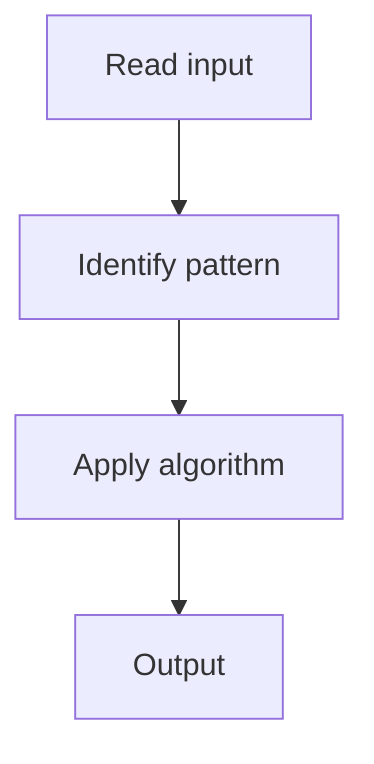

# 5. Top K Frequent Elements

## 1. Problem Description

Find the `k` most frequent elements in an array.

## 2. Expected Input

Array `nums` and integer `k`.

## 3. Expected Output

Return the `k` most frequent elements (any order).

## 4. Constraints

1 <= nums.length <= 10^5

## 5. Examples

| Input | Output |
|---|---|
| `nums=[1,1,1,2,2,3]`, `k=2` | `[1,2]` |

## 6. Intuition

Bucket sort: count frequencies, then bucket by frequency. Take top `k` buckets.

## 7. Thought Process



## 8. Brute-Force Approach

Sort by frequency. `O(n log n)`.

## 9. Optimized Solution

```python
def topKFrequent(nums, k):
    from collections import Counter
    count = Counter(nums)
    freq = [[] for _ in range(len(nums) + 1)]
    for n, c in count.items():
        freq[c].append(n)
    result = []
    for i in range(len(freq) - 1, 0, -1):
        for n in freq[i]:
            result.append(n)
            if len(result) == k:
                return result
```

## 10. Why the Optimized Solution Works

Bucket sort achieves `O(n)` because frequencies range from 1 to n.

## 11. Algorithm Used

Bucket sort.

## 12. Data Structures Used

List of buckets.

## 13. Time Complexity Analysis

O(n)

## 14. Space Complexity Analysis

O(n)

## 15. Step-by-Step Code Walkthrough

Count frequencies, place in buckets by frequency, collect top k from high to low.

## 16. Dry Run with Example

Skipped.

## 17. Common Pitfalls

- Using a heap (O(n log k)).

## 18. Edge Cases

| k = 1 | Most frequent element |

## 19. Alternative Approaches

Heap: `O(n log k)`.

## 20. Related Problems

[[4. Group Anagrams]], [[1. Kth Largest Element in a Stream]]

## 21. Key Takeaways

Bucket sort for `O(n)` top-k.
