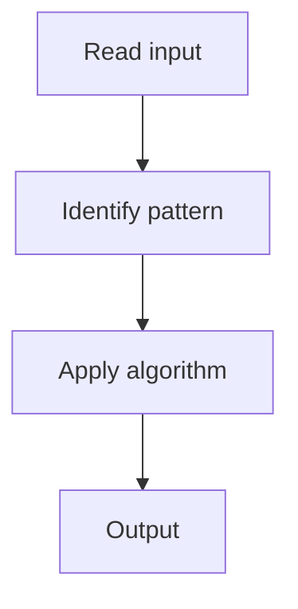

# 7. Product of Array Except Self

## 1. Problem Description

Return an array where `output[i]` is the product of all elements except `nums[i]`. Do not use division.

## 2. Expected Input

Array `nums`.

## 3. Expected Output

Array of products.

## 4. Constraints

2 <= nums.length <= 10^5

## 5. Examples

| Input | Output |
|---|---|
| `[1,2,3,4]` | `[24,12,8,6]` |

## 6. Intuition

Use prefix and suffix products. `output[i] = prefix[i-1] * suffix[i+1]`. Compute in-place with two passes.

## 7. Thought Process



## 8. Brute-Force Approach

Compute total product, divide by each element. Fails with zeros.

## 9. Optimized Solution

```python
def productExceptSelf(nums):
    n = len(nums)
    result = [1] * n
    prefix = 1
    for i in range(n):
        result[i] = prefix
        prefix *= nums[i]
    suffix = 1
    for i in range(n - 1, -1, -1):
        result[i] *= suffix
        suffix *= nums[i]
    return result
```

## 10. Why the Optimized Solution Works

First pass: `result[i]` = product of elements to the left. Second pass: multiply by product of elements to the right.

## 11. Algorithm Used

Prefix/suffix product.

## 12. Data Structures Used

Array (output).

## 13. Time Complexity Analysis

O(n)

## 14. Space Complexity Analysis

O(1)

## 15. Step-by-Step Code Walkthrough

Two passes: forward for prefix, backward for suffix.

## 16. Dry Run with Example

Skipped.

## 17. Common Pitfalls

- Using division (forbidden).

## 18. Edge Cases

| Contains zeros | Works |

## 19. Alternative Approaches

None.

## 20. Related Problems

[[5. Top K Frequent Elements]], [[8. Valid Sudoku]]

## 21. Key Takeaways

Prefix and suffix products without division.
