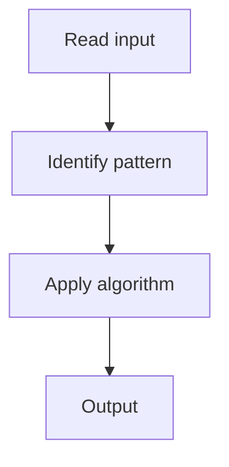

# 9. Longest Consecutive Sequence

## 1. Problem Description

Find the length of the longest consecutive elements sequence.

## 2. Expected Input

Array `nums`.

## 3. Expected Output

Length of the longest consecutive sequence.

## 4. Constraints

0 <= nums.length <= 10^5

## 5. Examples

| Input | Output |
|---|---|
| `[100,4,200,1,3,2]` | `4` (1,2,3,4) |

## 6. Intuition

Put all numbers in a set. For each number, if `n-1` is not in the set (it's a sequence start), count upward.

## 7. Thought Process



## 8. Brute-Force Approach

Sort. `O(n log n)`.

## 9. Optimized Solution

```python
def longestConsecutive(nums):
    num_set = set(nums)
    longest = 0
    for n in num_set:
        if n - 1 not in num_set:  # sequence start
            length = 1
            while n + length in num_set:
                length += 1
            longest = max(longest, length)
    return longest
```

## 10. Why the Optimized Solution Works

Only sequence starts (where `n-1` is absent) trigger counting. Each element is visited at most twice.

## 11. Algorithm Used

Hash set + sequence start detection.

## 12. Data Structures Used

Hash set.

## 13. Time Complexity Analysis

O(n)

## 14. Space Complexity Analysis

O(n)

## 15. Step-by-Step Code Walkthrough

For each number, check if it's a start; if so, count upward.

## 16. Dry Run with Example

Skipped.

## 17. Common Pitfalls

- Counting from every element (O(n^2)).

## 18. Edge Cases

| Empty array | 0 |

## 19. Alternative Approaches

Sort.

## 20. Related Problems

[[1. Contains Duplicate]], [[3. Two Sum]]

## 21. Key Takeaways

Sequence start detection for O(n) consecutive sequence.
