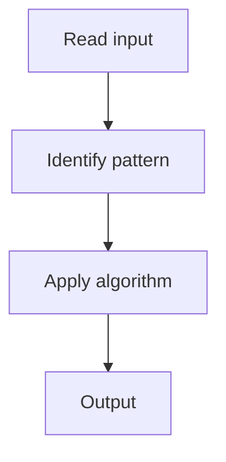

# 1. Subsets

## 1. Problem Description

Generate all possible subsets of an array.

## 2. Expected Input

Array of unique integers.

## 3. Expected Output

List of all subsets.

## 4. Constraints

1 <= n <= 10

## 5. Examples

| Input | Output |
|---|---|
| `[1,2,3]` | `[[],[1],[2],[3],[1,2],[1,3],[2,3],[1,2,3]]` |

## 6. Intuition

Backtracking. At each element, choose to include or not include.

## 7. Thought Process



## 8. Brute-Force Approach

Iterative: start with `[[]]`, double the list for each element.

## 9. Optimized Solution

```python
def subsets(nums):
    result = []
    def backtrack(start, current):
        result.append(current[:])
        for i in range(start, len(nums)):
            current.append(nums[i])
            backtrack(i + 1, current)
            current.pop()
    backtrack(0, [])
    return result
```

## 10. Why the Optimized Solution Works

At each step, we record the current subset and try adding each remaining element.

## 11. Algorithm Used

Backtracking.

## 12. Data Structures Used

Recursion stack + result list.

## 13. Time Complexity Analysis

O(2^n * n)

## 14. Space Complexity Analysis

O(n)

## 15. Step-by-Step Code Walkthrough

Add current to result; loop over remaining; recurse; backtrack.

## 16. Dry Run with Example

Skipped.

## 17. Common Pitfalls

- Not copying `current` (mutation issues).

## 18. Edge Cases

| Empty array | `[[]]` |

## 19. Alternative Approaches

Iterative doubling.

## 20. Related Problems

[[2. Combination Sum]], [[5. Subsets II]]

## 21. Key Takeaways

Backtracking template for subsets.
