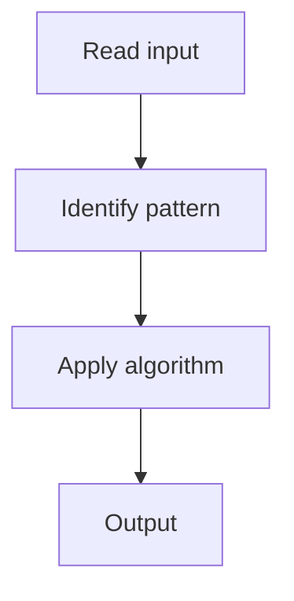

# 10. N-Queens

## 1. Problem Description

Place `n` queens on an `n x n` board so no two attack each other. Return all solutions.

## 2. Expected Input

Integer `n`.

## 3. Expected Output

List of solutions (each a board configuration).

## 4. Constraints

1 <= n <= 9

## 5. Examples

| Input | Output |
|---|---|
| `4` | 2 solutions |

## 6. Intuition

Backtracking row by row. Track columns and diagonals under attack.

## 7. Thought Process



## 8. Brute-Force Approach

Try all placements.

## 9. Optimized Solution

```python
def solveNQueens(n):
    result = []
    cols = set()
    diag1 = set()  # r + c
    diag2 = set()  # r - c
    
    def backtrack(row, board):
        if row == n:
            result.append([''.join(r) for r in board])
            return
        for c in range(n):
            if c in cols or row + c in diag1 or row - c in diag2:
                continue
            cols.add(c); diag1.add(row + c); diag2.add(row - c)
            board[row][c] = 'Q'
            backtrack(row + 1, board)
            board[row][c] = '.'
            cols.discard(c); diag1.discard(row + c); diag2.discard(row - c)
    
    backtrack(0, [['.' for _ in range(n)] for _ in range(n)])
    return result
```

## 10. Why the Optimized Solution Works

Place one queen per row. Track attacked columns and diagonals. Backtrack on failure.

## 11. Algorithm Used

Backtracking with constraint sets.

## 12. Data Structures Used

Sets for columns and diagonals.

## 13. Time Complexity Analysis

O(n!)

## 14. Space Complexity Analysis

O(n)

## 15. Step-by-Step Code Walkthrough

Place queen, mark attacks, recurse, unmark.

## 16. Dry Run with Example

Skipped.

## 17. Common Pitfalls

- Wrong diagonal formulas (`r+c` and `r-c`).

## 18. Edge Cases

| n = 1 | 1 solution |
| n = 2, 3 | No solution |

## 19. Alternative Approaches

None.

## 20. Related Problems

[[13. Chessboard and Queens]], [[1. Subsets]]

## 21. Key Takeaways

Backtracking with column/diagonal constraint sets.
