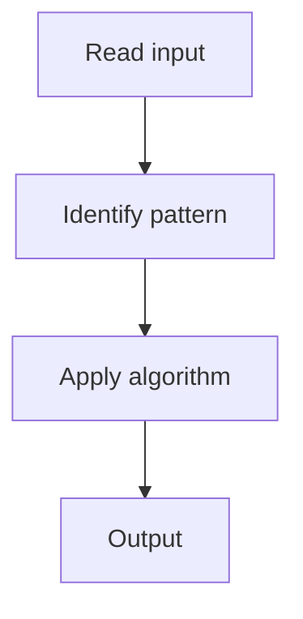

# 1. Number of Islands

## 1. Problem Description

Count the number of islands (connected components of '1's) in a grid.

## 2. Expected Input

Grid of '1' (land) and '0' (water).

## 3. Expected Output

Number of islands.

## 4. Constraints

m, n <= 300

## 5. Examples

| Input | Output |
|---|---|
| `[["1","1","0"],["1","0","0"]]` | `1` |

## 6. Intuition

Flood fill with BFS/DFS. For each unvisited land cell, start a flood and increment count.

## 7. Thought Process



## 8. Brute-Force Approach

None.

## 9. Optimized Solution

```python
def numIslands(grid):
    if not grid: return 0
    rows, cols = len(grid), len(grid[0])
    count = 0
    for r in range(rows):
        for c in range(cols):
            if grid[r][c] == '1':
                count += 1
                # BFS flood fill
                from collections import deque
                q = deque([(r, c)])
                grid[r][c] = '0'
                while q:
                    cr, cc = q.popleft()
                    for dr, dc in [(-1,0),(1,0),(0,-1),(0,1)]:
                        nr, nc = cr + dr, cc + dc
                        if 0 <= nr < rows and 0 <= nc < cols and grid[nr][nc] == '1':
                            grid[nr][nc] = '0'
                            q.append((nr, nc))
    return count
```

## 10. Why the Optimized Solution Works

BFS marks all connected land as visited (by setting to '0'). Each BFS start is a new island.

## 11. Algorithm Used

BFS flood fill.

## 12. Data Structures Used

Grid (mutated) + queue.

## 13. Time Complexity Analysis

O(n*m)

## 14. Space Complexity Analysis

O(n*m)

## 15. Step-by-Step Code Walkthrough

For each land cell, BFS and mark; increment count.

## 16. Dry Run with Example

Skipped.

## 17. Common Pitfalls

- Not marking visited (infinite loop).

## 18. Edge Cases

| Empty grid | 0 |

## 19. Alternative Approaches

DFS, Union-Find.

## 20. Related Problems

[[84. Counting Rooms]], [[2. Max Area of Island]]

## 21. Key Takeaways

BFS flood fill for island counting.
