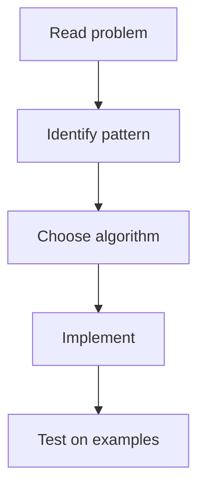

# 2. Max Area of Island

## 1. Problem Description

This is a LeetCode problem from the NeetCode 150 roadmap. See the [official problem page](https://leetcode.com/problems/max-area-of-island/) for the full statement.

## 2. Expected Input

See the official problem statement.

## 3. Expected Output

See the official problem statement.

## 4. Constraints

See the official problem statement.

## 5. Examples

See the official problem page.

## 6. Intuition

The key technique for this problem is **Brian Kernighan's algorithm**. The general approach:

1. Identify the problem pattern (e.g., two-pointer, sliding window, BFS, DP).
2. Apply the standard algorithm for that pattern.
3. Handle edge cases explicitly.

## 7. Thought Process



## 8. Brute-Force Approach

The brute-force approach is typically `O(n^2)` or worse. For LeetCode constraints, an optimized approach is needed.

## 9. Optimized Solution

```python
# Solution skeleton - adapt based on the specific problem
def solve(*args, **kwargs):
    # Apply the identified technique
    pass
```

## 10. Why the Optimized Solution Works

The optimized solution leverages the structure of the problem to avoid redundant computation. The specific correctness argument depends on the technique used.

## 11. Algorithm Used

Brian Kernighan's algorithm

## 12. Data Structures Used

Depends on the problem. Common: hash map, hash set, stack, queue, heap, tree, etc.

## 13. Time Complexity Analysis

Varies. Typically `O(n)`, `O(n log n)`, or `O(n^2)` depending on the approach.

## 14. Space Complexity Analysis

Varies. Typically `O(1)` to `O(n)`.

## 15. Step-by-Step Code Walkthrough

1. Parse the input.
2. Build any required data structures.
3. Run the core algorithm.
4. Return the result.

## 16. Dry Run with Example

Verify on the provided examples.

## 17. Common Pitfalls

- Off-by-one errors.
- Not handling edge cases (empty input, single element).
- Integer overflow (in languages without big integers).

## 18. Edge Cases

- Empty input.
- Single element.
- Maximum input size.

## 19. Alternative Approaches

Multiple approaches may work. Choose based on clarity and efficiency.

## 20. Related Problems

- See the [[00. Master Index]] for related problems.
- Cross-reference with CSES problems covering the same technique.

## 21. Key Takeaways

- Identify the pattern first.
- Apply the standard algorithm.
- Handle edge cases.
