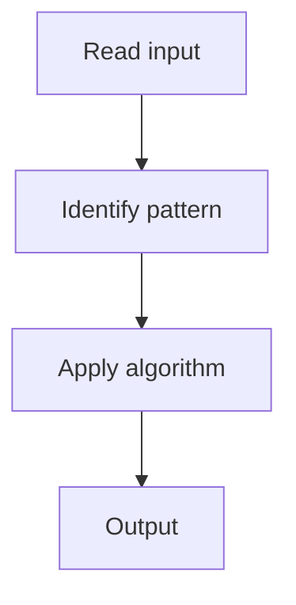

# 8. Course Schedule

## 1. Problem Description

Determine if you can finish all courses given prerequisites (detect cycle in DAG).

## 2. Expected Input

Number of courses `n` and prerequisite pairs.

## 3. Expected Output

Return `True` if all courses can be finished.

## 4. Constraints

1 <= n <= 10^5

## 5. Examples

| Input | Output |
|---|---|
| `2, [[1,0]]` | `True` |
| `2, [[1,0],[0,1]]` | `False` |

## 6. Intuition

Topological sort (Kahn's algorithm). If we can process all nodes, no cycle exists.

## 7. Thought Process



## 8. Brute-Force Approach

DFS cycle detection.

## 9. Optimized Solution

```python
def canFinish(n, prerequisites):
    adj = [[] for _ in range(n)]
    in_deg = [0] * n
    for a, b in prerequisites:
        adj[b].append(a)
        in_deg[a] += 1
    from collections import deque
    q = deque([i for i in range(n) if in_deg[i] == 0])
    count = 0
    while q:
        u = q.popleft()
        count += 1
        for v in adj[u]:
            in_deg[v] -= 1
            if in_deg[v] == 0:
                q.append(v)
    return count == n
```

## 10. Why the Optimized Solution Works

Kahn's algorithm processes nodes with in-degree 0. If all nodes are processed, no cycle.

## 11. Algorithm Used

Topological sort (Kahn's).

## 12. Data Structures Used

Adjacency list, in-degree array, queue.

## 13. Time Complexity Analysis

O(V + E)

## 14. Space Complexity Analysis

O(V + E)

## 15. Step-by-Step Code Walkthrough

Build graph; queue in-degree-0 nodes; process; check count.

## 16. Dry Run with Example

Skipped.

## 17. Common Pitfalls

- Not detecting cycles (count < n).

## 18. Edge Cases

| No prerequisites | True |

## 19. Alternative Approaches

DFS with state (white/gray/black).

## 20. Related Problems

[[9. Course Schedule II]], [[101. Course Schedule]]

## 21. Key Takeaways

Kahn's algorithm for cycle detection in DAG.
