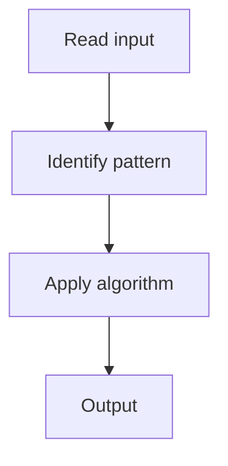

# 1. Climbing Stairs

## 1. Problem Description

Count ways to climb `n` stairs, taking 1 or 2 steps at a time.

## 2. Expected Input

Integer `n`.

## 3. Expected Output

Number of ways.

## 4. Constraints

1 <= n <= 45

## 5. Examples

| Input | Output |
|---|---|
| `2` | `2` |
| `3` | `3` |

## 6. Intuition

Fibonacci: `dp[i] = dp[i-1] + dp[i-2]`. Space-optimized to two variables.

## 7. Thought Process



## 8. Brute-Force Approach

Recursion without memo. Exponential.

## 9. Optimized Solution

```python
def climbStairs(n):
    if n <= 2:
        return n
    a, b = 1, 2
    for _ in range(3, n + 1):
        a, b = b, a + b
    return b
```

## 10. Why the Optimized Solution Works

The number of ways to reach step `i` is the sum of ways to reach `i-1` and `i-2`.

## 11. Algorithm Used

1D DP (Fibonacci).

## 12. Data Structures Used

Two variables.

## 13. Time Complexity Analysis

O(n)

## 14. Space Complexity Analysis

O(1)

## 15. Step-by-Step Code Walkthrough

Iterate, updating `a, b = b, a + b`.

## 16. Dry Run with Example

Skipped.

## 17. Common Pitfalls

- Using `O(n)` space unnecessarily.

## 18. Edge Cases

| n = 1 | 1 |

## 19. Alternative Approaches

Matrix exponentiation.

## 20. Related Problems

[[2. Min Cost Climbing Stairs]], [[3. House Robber]]

## 21. Key Takeaways

Fibonacci DP with space optimization.
