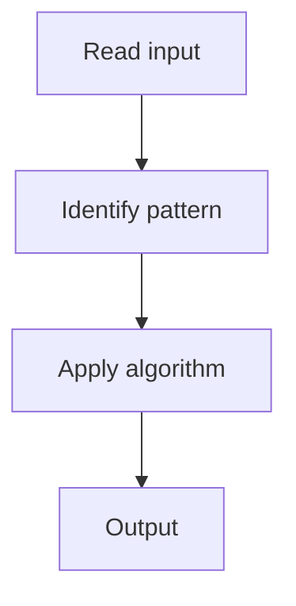

# 3. House Robber

## 1. Problem Description

Maximize the amount robbed from houses (can't rob adjacent houses).

## 2. Expected Input

Array of money in each house.

## 3. Expected Output

Maximum amount.

## 4. Constraints

1 <= n <= 100

## 5. Examples

| Input | Output |
|---|---|
| `[1,2,3,1]` | `4` |

## 6. Intuition

DP: `dp[i] = max(dp[i-1], dp[i-2] + nums[i])`. Rob this house (and skip prev) or skip this house.

## 7. Thought Process



## 8. Brute-Force Approach

Recursion.

## 9. Optimized Solution

```python
def rob(nums):
    prev, curr = 0, 0
    for x in nums:
        prev, curr = curr, max(curr, prev + x)
    return curr
```

## 10. Why the Optimized Solution Works

At each house, either skip it (take `curr`) or rob it (take `prev + nums[i]`).

## 11. Algorithm Used

1D DP.

## 12. Data Structures Used

Two variables.

## 13. Time Complexity Analysis

O(n)

## 14. Space Complexity Analysis

O(1)

## 15. Step-by-Step Code Walkthrough

Iterate, updating `prev, curr`.

## 16. Dry Run with Example

Skipped.

## 17. Common Pitfalls

- Adjacent robbery (not skipping).

## 18. Edge Cases

| Single house | nums[0] |

## 19. Alternative Approaches

None.

## 20. Related Problems

[[4. House Robber II]], [[1. Climbing Stairs]]

## 21. Key Takeaways

Take/skip DP with space optimization.
