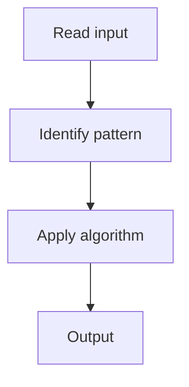

# 8. Coin Change

## 1. Problem Description

Find the minimum number of coins to make a given amount.

## 2. Expected Input

Array of coin denominations and integer `amount`.

## 3. Expected Output

Minimum coins, or -1 if impossible.

## 4. Constraints

1 <= amount <= 10^4

## 5. Examples

| Input | Output |
|---|---|
| `coins=[1,2,5]`, `amount=11` | `3` (5+5+1) |

## 6. Intuition

DP: `dp[i]` = min coins for amount `i`. `dp[i] = min(dp[i - c] + 1)` for each coin `c`.

## 7. Thought Process



## 8. Brute-Force Approach

Recursion.

## 9. Optimized Solution

```python
def coinChange(coins, amount):
    INF = float('inf')
    dp = [0] + [INF] * amount
    for i in range(1, amount + 1):
        for c in coins:
            if i >= c:
                dp[i] = min(dp[i], dp[i - c] + 1)
    return dp[amount] if dp[amount] != INF else -1
```

## 10. Why the Optimized Solution Works

To make amount `i`, the last coin was `c`, and we need `dp[i - c] + 1`.

## 11. Algorithm Used

1D DP.

## 12. Data Structures Used

DP array.

## 13. Time Complexity Analysis

O(n * k)

## 14. Space Complexity Analysis

O(n)

## 15. Step-by-Step Code Walkthrough

Initialize with INF; for each amount, try each coin.

## 16. Dry Run with Example

Skipped.

## 17. Common Pitfalls

- Not handling impossible cases.

## 18. Edge Cases

| amount = 0 | 0 |

## 19. Alternative Approaches

BFS.

## 20. Related Problems

[[66. Minimizing Coins]], [[4. Coin Change II]]

## 21. Key Takeaways

Min coin change DP.
