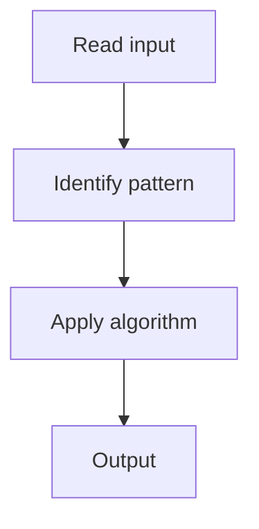

# 1. Unique Paths

## 1. Problem Description

Count paths from top-left to bottom-right of an `m x n` grid, moving only right or down.

## 2. Expected Input

Integers `m` and `n`.

## 3. Expected Output

Number of unique paths.

## 4. Constraints

1 <= m, n <= 100

## 5. Examples

| Input | Output |
|---|---|
| `3, 7` | `28` |

## 6. Intuition

DP: `dp[i][j] = dp[i-1][j] + dp[i][j-1]`. Space-optimized to 1D.

## 7. Thought Process



## 8. Brute-Force Approach

Recursion with memo.

## 9. Optimized Solution

```python
def uniquePaths(m, n):
    dp = [1] * n
    for _ in range(1, m):
        for j in range(1, n):
            dp[j] += dp[j - 1]
    return dp[-1]
```

## 10. Why the Optimized Solution Works

Each cell can be reached from above or from the left.

## 11. Algorithm Used

2D DP (space-optimized).

## 12. Data Structures Used

1D array.

## 13. Time Complexity Analysis

O(m * n)

## 14. Space Complexity Analysis

O(n)

## 15. Step-by-Step Code Walkthrough

First row is all 1s. For each subsequent row, accumulate.

## 16. Dry Run with Example

Skipped.

## 17. Common Pitfalls

- Using `O(m * n)` space unnecessarily.

## 18. Edge Cases

| 1x1 grid | 1 |

## 19. Alternative Approaches

Combinatorics: `C(m+n-2, m-1)`.

## 20. Related Problems

[[70. Grid Paths I]], [[2. Longest Common Subsequence]]

## 21. Key Takeaways

Grid DP with space optimization.
