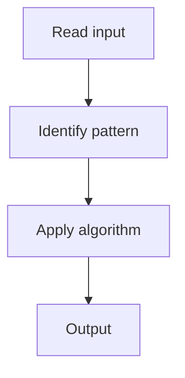

# 9. Edit Distance

## 1. Problem Description

Compute the edit distance (Levenshtein) between two strings.

## 2. Expected Input

Two strings `word1` and `word2`.

## 3. Expected Output

Minimum edit operations.

## 4. Constraints

1 <= lengths <= 500

## 5. Examples

| Input | Output |
|---|---|
| `horse`, `ros` | `3` |

## 6. Intuition

DP: if match, `dp[i-1][j-1]`; else `1 + min(dp[i-1][j], dp[i][j-1], dp[i-1][j-1])`.

## 7. Thought Process



## 8. Brute-Force Approach

Recursion.

## 9. Optimized Solution

```python
def minDistance(word1, word2):
    n, m = len(word1), len(word2)
    dp = [[0] * (m + 1) for _ in range(n + 1)]
    for i in range(n + 1): dp[i][0] = i
    for j in range(m + 1): dp[0][j] = j
    for i in range(1, n + 1):
        for j in range(1, m + 1):
            if word1[i-1] == word2[j-1]:
                dp[i][j] = dp[i-1][j-1]
            else:
                dp[i][j] = 1 + min(dp[i-1][j], dp[i][j-1], dp[i-1][j-1])
    return dp[n][m]
```

## 10. Why the Optimized Solution Works

Three operations: insert, delete, substitute. Take the min.

## 11. Algorithm Used

2D DP.

## 12. Data Structures Used

2D array.

## 13. Time Complexity Analysis

O(n * m)

## 14. Space Complexity Analysis

O(n * m)

## 15. Step-by-Step Code Walkthrough

Base cases; for each cell, if match, copy diagonal; else 1 + min of three.

## 16. Dry Run with Example

Skipped.

## 17. Common Pitfalls

- Wrong base cases.

## 18. Edge Cases

| Empty strings | Length of other |

## 19. Alternative Approaches

Space-optimized to 1D.

## 20. Related Problems

[[71. Edit Distance]], [[2. Longest Common Subsequence]]

## 21. Key Takeaways

Levenshtein DP.
