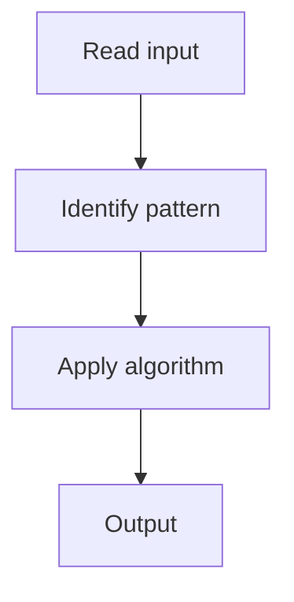

# 1. Maximum Subarray

## 1. Problem Description

Find the contiguous subarray with the largest sum.

## 2. Expected Input

Array of integers.

## 3. Expected Output

Maximum subarray sum.

## 4. Constraints

n >= 1

## 5. Examples

| Input | Output |
|---|---|
| `[-2,1,-3,4,-1,2,1,-5,4]` | `6` |

## 6. Intuition

Kadane's algorithm.

## 7. Thought Process



## 8. Brute-Force Approach

Check all subarrays.

## 9. Optimized Solution

```python
def maxSubArray(nums):
    best = current = nums[0]
    for x in nums[1:]:
        current = max(x, current + x)
        best = max(best, current)
    return best
```

## 10. Why the Optimized Solution Works

At each position, decide: start fresh or extend previous.

## 11. Algorithm Used

Kadane's algorithm.

## 12. Data Structures Used

Two variables.

## 13. Time Complexity Analysis

O(n)

## 14. Space Complexity Analysis

O(1)

## 15. Step-by-Step Code Walkthrough

Track current and best; at each step, current = max(x, current + x).

## 16. Dry Run with Example

Skipped.

## 17. Common Pitfalls

- Initializing best to 0 (fails for all negative).

## 18. Edge Cases

| All negative | Max single element |

## 19. Alternative Approaches

Divide and conquer.

## 20. Related Problems

[[44. Maximum Subarray Sum]], [[9. Maximum Product Subarray]]

## 21. Key Takeaways

Kadane's algorithm.
