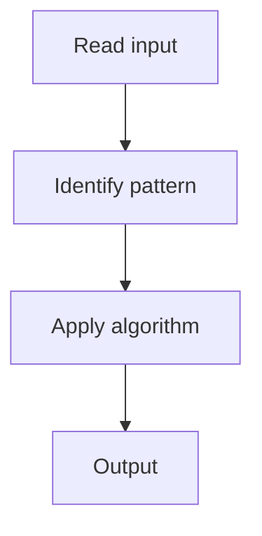

# 2. Jump Game

## 1. Problem Description

Determine if you can reach the last index, given max jump lengths.

## 2. Expected Input

Array of non-negative integers.

## 3. Expected Output

Return `True` if reachable.

## 4. Constraints

n >= 1

## 5. Examples

| Input | Output |
|---|---|
| `[2,3,1,1,4]` | `True` |

## 6. Intuition

Greedy: track the farthest reachable index. If we ever can't reach the current position, return False.

## 7. Thought Process



## 8. Brute-Force Approach

DP: `O(n^2)`.

## 9. Optimized Solution

```python
def canJump(nums):
    farthest = 0
    for i in range(len(nums)):
        if i > farthest:
            return False
        farthest = max(farthest, i + nums[i])
    return True
```

## 10. Why the Optimized Solution Works

If we can reach position `i`, we can reach any position up to `i + nums[i]`.

## 11. Algorithm Used

Greedy.

## 12. Data Structures Used

One variable.

## 13. Time Complexity Analysis

O(n)

## 14. Space Complexity Analysis

O(1)

## 15. Step-by-Step Code Walkthrough

Track farthest; if i exceeds farthest, fail.

## 16. Dry Run with Example

Skipped.

## 17. Common Pitfalls

- Using DP (overkill).

## 18. Edge Cases

| Single element | True |

## 19. Alternative Approaches

DP.

## 20. Related Problems

[[3. Jump Game II]], [[1. Maximum Subarray]]

## 21. Key Takeaways

Greedy farthest-reachable tracking.
