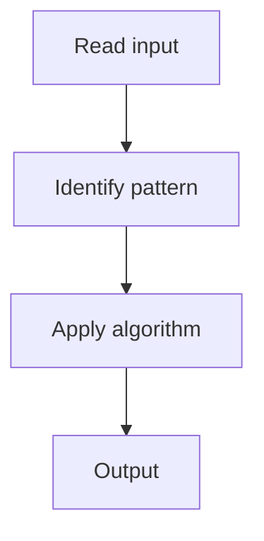

# 2. Merge Intervals

## 1. Problem Description

Merge overlapping intervals.

## 2. Expected Input

Array of intervals `[start, end]`.

## 3. Expected Output

Merged intervals.

## 4. Constraints

n >= 1

## 5. Examples

| Input | Output |
|---|---|
| `[[1,3],[2,6],[8,10]]` | `[[1,6],[8,10]]` |

## 6. Intuition

Sort by start. Merge if the next start <= current end.

## 7. Thought Process



## 8. Brute-Force Approach

Check all pairs.

## 9. Optimized Solution

```python
def merge(intervals):
    intervals.sort()
    result = [intervals[0]]
    for s, e in intervals[1:]:
        if s <= result[-1][1]:
            result[-1][1] = max(result[-1][1], e)
        else:
            result.append([s, e])
    return result
```

## 10. Why the Optimized Solution Works

Sorting by start ensures we process intervals in order. Merge when the next overlaps the current.

## 11. Algorithm Used

Sort + merge.

## 12. Data Structures Used

List.

## 13. Time Complexity Analysis

O(n log n)

## 14. Space Complexity Analysis

O(n)

## 15. Step-by-Step Code Walkthrough

Sort; for each interval, merge or append.

## 16. Dry Run with Example

Skipped.

## 17. Common Pitfalls

- Not sorting first.

## 18. Edge Cases

| Single interval | Same |

## 19. Alternative Approaches

None.

## 20. Related Problems

[[1. Insert Interval]], [[37. Movie Festival]]

## 21. Key Takeaways

Sort + merge for intervals.
