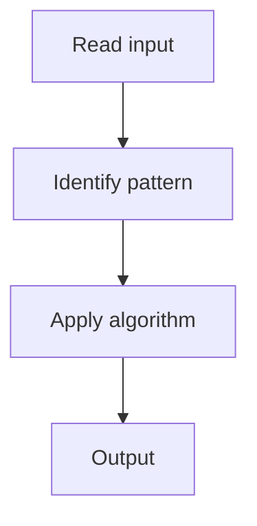

# 1. Single Number

## 1. Problem Description

Find the element that appears once when every other appears twice.

## 2. Expected Input

Array of integers.

## 3. Expected Output

The single number.

## 4. Constraints

n >= 1

## 5. Examples

| Input | Output |
|---|---|
| `[4,1,2,1,2]` | `4` |

## 6. Intuition

XOR all elements. Pairs cancel out (`a ^ a = 0`).

## 7. Thought Process



## 8. Brute-Force Approach

Hash set.

## 9. Optimized Solution

```python
def singleNumber(nums):
    result = 0
    for x in nums:
        result ^= x
    return result
```

## 10. Why the Optimized Solution Works

XOR is associative and commutative. `a ^ a = 0` and `a ^ 0 = a`.

## 11. Algorithm Used

XOR.

## 12. Data Structures Used

One variable.

## 13. Time Complexity Analysis

O(n)

## 14. Space Complexity Analysis

O(1)

## 15. Step-by-Step Code Walkthrough

XOR all elements.

## 16. Dry Run with Example

Skipped.

## 17. Common Pitfalls

- Using a hash set (O(n) space).

## 18. Edge Cases

| Single element | That element |

## 19. Alternative Approaches

Hash map counting.

## 20. Related Problems

[[2. Number of 1 Bits]], [[6. Missing Number]]

## 21. Key Takeaways

XOR for finding the unique element.
