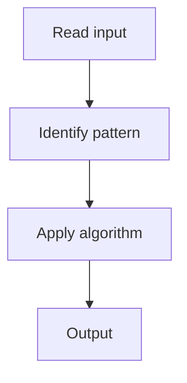

# 5. Missing Number

## 1. Problem Description

Find the missing number in `[0, n]` given `n` distinct numbers.

## 2. Expected Input

Array of `n` distinct numbers from `[0, n]`.

## 3. Expected Output

The missing number.

## 4. Constraints

n >= 1

## 5. Examples

| Input | Output |
|---|---|
| `[3,0,1]` | `2` |

## 6. Intuition

XOR all indices and all values. The missing number remains. Or use Gauss's formula.

## 7. Thought Process



## 8. Brute-Force Approach

Hash set.

## 9. Optimized Solution

```python
def missingNumber(nums):
    n = len(nums)
    total = n * (n + 1) // 2
    return total - sum(nums)
```

## 10. Why the Optimized Solution Works

Sum of `[0, n]` minus sum of given numbers.

## 11. Algorithm Used

Math (Gauss's formula).

## 12. Data Structures Used

One variable.

## 13. Time Complexity Analysis

O(n)

## 14. Space Complexity Analysis

O(1)

## 15. Step-by-Step Code Walkthrough

Compute expected sum; subtract actual sum.

## 16. Dry Run with Example

Skipped.

## 17. Common Pitfalls

- Off-by-one in range.

## 18. Edge Cases

| Empty array | 0 |

## 19. Alternative Approaches

XOR.

## 20. Related Problems

[[6. Missing Number]], [[1. Single Number]]

## 21. Key Takeaways

Gauss's formula for missing number.
